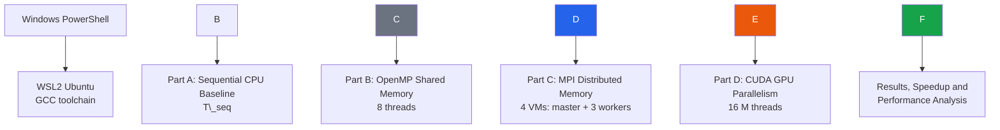
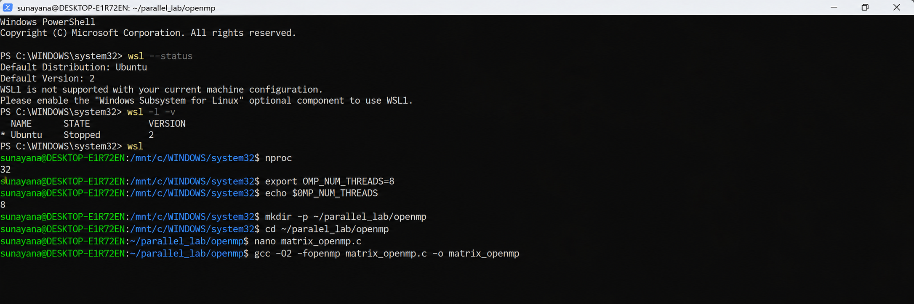
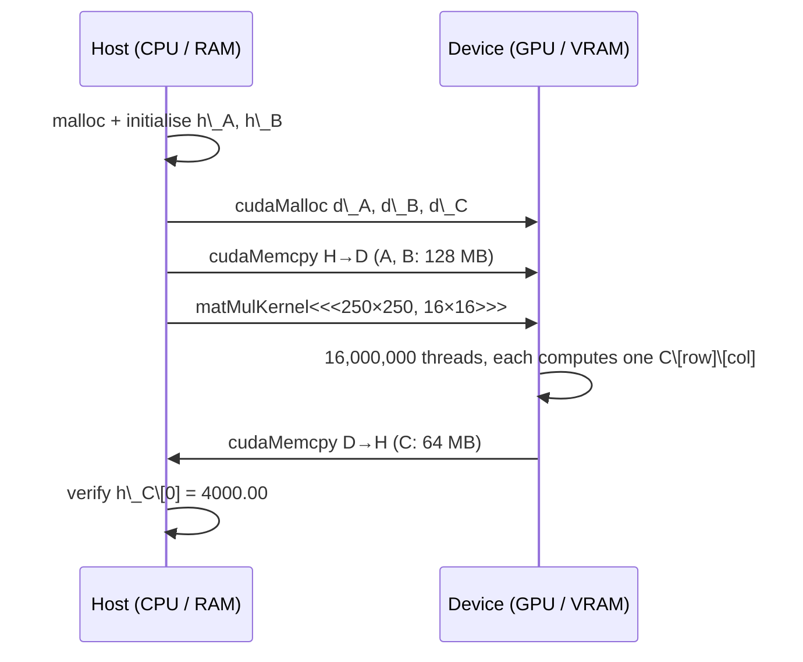

<div align="center">

# Experiment 1 — Parallel Matrix Multiplication

### A Comparative Study of Sequential, OpenMP, MPI and CUDA Computing Models

**Course:** Parallel Computing and GPU Programming (PGC) Laboratory
**Problem Size:** 4000 × 4000 dense matrix multiplication ( $C = A \\times B$ )
**Models Evaluated:** Sequential CPU · OpenMP (shared memory) · MPI (distributed memory) · CUDA (GPU SIMT)

!\[Models](https://img.shields.io/badge/Models-Sequential%20%7C%20OpenMP%20%7C%20MPI%20%7C%20CUDA-1f2937)
!\[Language](https://img.shields.io/badge/Language-C%20%2F%20CUDA%20C-2563eb)
!\[Verification](https://img.shields.io/badge/Verification-C%5B0%5D%5B0%5D%20%3D%204000.00-16a34a)
!\[Best Speedup](https://img.shields.io/badge/Best%20Speedup-3457x%20(CUDA)-ea580c)

</div>

\---

## Abstract

This experiment implements the same $4000 \\times 4000$ dense matrix multiplication with four computing models and compares how they perform. A single-threaded C program running on WSL2 Ubuntu sets the **sequential baseline at 266.48 s**. The same triple-loop algorithm is then parallelised in three ways. **OpenMP** shares the work among 8 threads on one machine and finishes in **41.02 s (6.50× speedup, 81.2 % efficiency)**. **MPI** distributes the rows across a four-node cluster of Ubuntu virtual machines and finishes in **226.17 s (1.18× speedup, 29.5 % efficiency)**. **CUDA** offloads the work to an NVIDIA GPU with 16 million logical threads and completes the whole GPU phase, data transfers included, in **0.077 s (3,456.84× speedup)**. Every implementation produced the analytically expected value $C\[0]\[0] = 4000.00$. The report also analyses throughput (GFLOP/s), parallel efficiency, Amdahl's law with the Karp–Flatt metric, CUDA data-transfer overhead and MPI communication overhead. Together these show how the memory model, communication cost and hardware parallelism decide real-world performance.

\---

## Table of Contents

1. [Introduction](#1-introduction)
2. [Aim and Objectives](#2-aim-and-objectives)
3. [Theoretical Background](#3-theoretical-background)
4. [Problem Definition](#4-problem-definition)
5. [Experimental Setup](#5-experimental-setup)
6. [Methodology and Execution Flow](#6-methodology-and-execution-flow)
7. [Part A — Sequential Matrix Multiplication](#7-part-a--sequential-matrix-multiplication)
8. [Part B — OpenMP Matrix Multiplication](#8-part-b--openmp-matrix-multiplication)
9. [Part C — MPI Distributed Matrix Multiplication](#9-part-c--mpi-distributed-matrix-multiplication)
10. [Part D — CUDA Matrix Multiplication](#10-part-d--cuda-matrix-multiplication)
11. [Consolidated Results](#11-consolidated-results)
12. [Performance Analysis](#12-performance-analysis)
13. [Comparative Discussion of the Four Models](#13-comparative-discussion-of-the-four-models)
14. [Threats to Validity and Deviations from Reference](#14-threats-to-validity-and-deviations-from-reference)
15. [Troubleshooting and Issues Encountered](#15-troubleshooting-and-issues-encountered)
16. [Conclusion](#16-conclusion)
17. [Repository Structure and Reproduction](#17-repository-structure-and-reproduction)
18. [References](#18-references)

\---

## 1\. Introduction

Matrix multiplication is the canonical workload of high-performance computing. Its cost grows as $\\mathcal{O}(N^3)$ while its data grows only as $\\mathcal{O}(N^2)$, so it is highly compute-intensive. Every output element can also be computed independently, which makes it **embarrassingly parallel** at the level of output elements. These properties make it a good benchmark for comparing parallel programming models.

This experiment solves **one fixed problem** in four different ways:

|#|Model|Parallelism Type|Memory Model|Execution Platform|
|:-:|-|-|-|-|
|A|Sequential|None (baseline)|Single address space|WSL2 Ubuntu, 1 CPU core|
|B|OpenMP|Thread-level (fork–join)|Shared memory|WSL2 Ubuntu, 8 threads|
|C|MPI|Process-level (SPMD)|Distributed memory|4 Ubuntu VMs on VMware|
|D|CUDA|Data-parallel (SIMT)|Host/device (discrete GPU memory)|NVIDIA GPU|

The algorithm and the input data stay the same across all four. Any difference in run time therefore comes from the **computing model and its hardware**, not from the mathematics.

\---

## 2\. Aim and Objectives

**Aim:** To implement $4000 \\times 4000$ matrix multiplication using sequential, OpenMP, MPI and CUDA programming models, and to compare their performance quantitatively.

**Objectives:**

1. Set up a Linux build environment (WSL2 + GCC) and establish a sequential baseline.
2. Parallelise the computation on a shared-memory multicore CPU using OpenMP directives.
3. Build a four-node MPI cluster (one master and three workers) using VMware virtual machines, OpenSSH and Open MPI, and distribute the computation with collective communication (`MPI\_Scatter`, `MPI\_Bcast`, `MPI\_Gather`).
4. Offload the computation to an NVIDIA GPU using a CUDA kernel in which one thread computes one output element.
5. Verify correctness for every model ($C\[0]\[0] = 4000.00$).
6. Measure execution time, then derive speedup, efficiency, throughput and overheads, and present the results graphically.

\---

## 3\. Theoretical Background

### 3.1 Matrix Multiplication

For square matrices $A, B \\in \\mathbb{R}^{N \\times N}$, the product $C = AB$ is defined element-wise as:

$$
C\_{ij} ;=; \\sum\_{k=0}^{N-1} A\_{ik},B\_{kj}, \\qquad 0 \\le i, j < N
$$

Each of the $N^2$ output elements needs $N$ multiplications and $N$ additions, so the total work is:

$$
W = 2N^3 = 2 \\times 4000^3 = 1.28 \\times 10^{11}\\ \\text{floating-point operations (FLOP)}
$$

|Quantity|Value|
|-|-|
|Output elements|$N^2 = 16{,}000{,}000$|
|Total FLOPs|$1.28 \\times 10^{11}$|
|Size of one matrix (FP64, CPU versions)|$4000^2 \\times 8\\ \\text{B} = 128\\ \\text{MB}$|
|Size of one matrix (FP32, CUDA version)|$4000^2 \\times 4\\ \\text{B} = 64\\ \\text{MB}$|
|Total working set (A, B, C)|384 MB (FP64) / 192 MB (FP32)|

### 3.2 Parallel Computing Models

|Concept|OpenMP|MPI|CUDA|
|-|-|-|-|
|**Flynn class**|MIMD (shared memory)|MIMD (distributed memory)|SIMT (a SIMD variant)|
|**Unit of execution**|Thread|Process (rank)|GPU thread (in warps of 32)|
|**Data sharing**|Implicit, through shared variables|Explicit messages|Explicit `cudaMemcpy` between host and device|
|**Programming style**|Compiler directives (`#pragma omp`)|Library calls (`MPI\_\*`)|Kernel functions (`\_\_global\_\_`)|
|**Scalability limit**|Cores in one node, memory bandwidth|Network bandwidth and latency|PCIe transfer, GPU memory bandwidth|

### 3.3 Performance Metrics

|Metric|Formula|Meaning|
|-|-|-|
|Speedup|$S = T\_{seq} / T\_{par}$|How many times faster than the baseline|
|Parallel efficiency|$E = S / p$|Fraction of ideal linear speedup achieved with $p$ workers|
|Throughput|$\\text{GFLOP/s} = 2N^3 / (T \\times 10^9)$|Rate of useful arithmetic|
|Amdahl's law|$S(p) = \\dfrac{1}{f + (1-f)/p}$|Upper bound on speedup for serial fraction $f$|
|Karp–Flatt metric|$e = \\dfrac{1/S - 1/p}{1 - 1/p}$|Serial fraction plus overhead, as observed experimentally|

\---

## 4\. Problem Definition

```text
A = 4000 × 4000 matrix, all elements = 1.0
B = 4000 × 4000 matrix, all elements = 1.0
C = A × B

C\[0]\[0] = 1×1 + 1×1 + ... + 1×1   (4000 terms)
C\[0]\[0] = 4000.00
```

Every element of $A$ and $B$ is 1.0, so **every** element of $C$ must equal $N = 4000$. This gives a simple, deterministic check of correctness for every implementation. All matrices are stored in **row-major, one-dimensional arrays**, where element $(i, j)$ is at index `i \* N + j`.

\---

## 5\. Experimental Setup

### 5.1 Hardware and Software Configuration

The setup details below are based on the terminal output recorded during the experiment.

|Component|Sequential \& OpenMP|MPI Cluster|CUDA|
|-|-|-|-|
|**Host OS**|Windows 11 + WSL2|Windows host + VMware Workstation|Windows (x64 Native Tools Command Prompt)|
|**Guest / Runtime OS**|Ubuntu (WSL2, default version 2)|4 × Ubuntu 24.04 LTS VMs|Native Windows|
|**Compiler**|GCC 15.2.0 (`build-essential`)|GCC 13.3.0 via `mpicc` (Open MPI)|`nvcc` (CUDA Toolkit) + MSVC host compiler|
|**Optimisation flags**|`-O2` / `-O2 -fopenmp`|`-O2`|`-O2`|
|**Logical CPUs visible**|32 (`nproc`)|1 slot per node|—|
|**Workers used**|1 thread / 8 threads|4 MPI processes|250 × 250 blocks × 256 threads|
|**Precision**|FP64 (`double`)|FP64 (`double`)|FP32 (`float`)|
|**Timer**|`clock()` / `omp\_get\_wtime()`|`MPI\_Wtime()`|`cudaEvent\_t`|

### 5.2 Components Required

**Hardware:** a Windows 10/11 host with enough CPU cores and RAM for WSL and the virtual machines, four Ubuntu virtual machines for the MPI experiment, and an NVIDIA CUDA-capable GPU.

**Software:** Windows PowerShell; WSL2 with Ubuntu; GCC / `build-essential` (which provides OpenMP support); Open MPI (`openmpi-bin`, `libopenmpi-dev`) and OpenSSH Server; the CUDA Toolkit with `nvcc`; and VMware Workstation or an equivalent hypervisor.

\---

## 6\. Methodology and Execution Flow



The same procedure was followed for every model:

1. **Verify the environment.** Check the toolchain, runtime and hardware visibility.
2. **Write the source code** in a dedicated directory (`\~/parallel\_lab/<model>`).
3. **Compile** with `-O2` optimisation.
4. **Execute** and record the timing that the program prints.
5. **Verify** that $C\[0]\[0] = 4000.00$.
6. **Compute** speedup and the derived metrics against the sequential baseline.

> \*\*Timing scope.\*\* Each program times only the \*\*multiplication phase\*\*, plus communication for MPI and transfers for CUDA. Matrix allocation and initialisation are excluded from every measurement.

\---

## 7\. Part A — Sequential Matrix Multiplication

### 7.1 Working Principle

The sequential version is the **reference baseline**. One CPU thread runs the classic `i-j-k` triple loop, computing one output element at a time:

```text
for i in 0..N-1:            ← row of C
  for j in 0..N-1:          ← column of C
    for k in 0..N-1:        ← dot-product index
      C\[i]\[j] += A\[i]\[k] \* B\[k]\[j]
```

* **Time complexity:** $\\mathcal{O}(N^3)$, which is $6.4 \\times 10^{10}$ multiply–add pairs.
* **Memory access pattern:** `A\[i\*N+k]` is read **contiguously** (stride 1), but `B\[k\*N+j]` is read **column-wise** with a stride of $N = 4000$ doubles (32 KB). Almost every access to `B` therefore misses the cache. This is one main reason the baseline reaches only 0.48 GFLOP/s.

### 7.2 Prerequisites

* Windows PowerShell is available.
* WSL2 is installed and an Ubuntu distribution is available.
* Internet access for installing packages.
* `sudo` permission inside Ubuntu.

### 7.3 Procedure

|Step|Where|Command|Purpose|
|:-:|-|-|-|
|1|PowerShell|`wsl --status`|Confirm WSL is installed (default version 2)|
|2|PowerShell|`wsl -l -v`|List distributions and their WSL version|
|3|PowerShell|`wsl --install -d Ubuntu`|Install Ubuntu (needed because no distribution was installed)|
|4|PowerShell|`wsl`|Enter the Ubuntu shell|
|5|Ubuntu|`sudo apt update`|Refresh the package index|
|6|Ubuntu|`sudo apt install build-essential -y`|Install GCC, make and the standard libraries|
|7|Ubuntu|`gcc --version`|Verify the compiler (GCC 15.2.0)|
|8|Ubuntu|`mkdir -p \~/parallel\_lab/sequential \&\& cd $\_`|Create the working directory|
|9|Ubuntu|`nano matrix\_sequential.c`|Write the source code|
|10|Ubuntu|`gcc -O2 matrix\_sequential.c -o matrix\_sequential`|Compile with optimisation|
|11|Ubuntu|`ls -l`|Confirm the executable exists|
|12|Ubuntu|`./matrix\_sequential`|Run the baseline|

### 7.4 Source Code — Core Kernel

Full source: [`src/matrix\_sequential.c`](src/matrix_sequential.c)

```c
start = clock();

for (i = 0; i < N; i++)
    for (j = 0; j < N; j++)
        for (k = 0; k < N; k++)
            C\[i \* N + j] += A\[i \* N + k] \* B\[k \* N + j];

end = clock();
printf("Execution Time = %f seconds\\n", (double)(end - start) / CLOCKS\_PER\_SEC);
```

### 7.5 Result

```text
Initializing 4000 x 4000 matrices...

Sequential Matrix Multiplication Completed
Matrix Size = 4000 x 4000
Execution Time = 266.477234 seconds
Verification C\[0]\[0] = 4000.00
```

|Metric|Value|
|-|-|
|Execution time ( $T\_{seq}$ )|**266.477234 s**|
|Throughput|0.48 GFLOP/s|
|Verification|✅ $C\[0]\[0] = 4000.00$|

### 7.6 Screenshots

<p align="center">
  <br>
  <em>Figure A.1 — WSL verification in PowerShell (<code>wsl --status</code>, <code>wsl -l -v</code>), Ubuntu installation and user creation.</em>
</p>

<p align="center">
  <br>
  <em>Figure A.2 — <code>build-essential</code> installation, <code>gcc --version</code>, compilation, <code>ls -l</code> and final sequential output (266.477234 s).</em>
</p>

\---

## 8\. Part B — OpenMP Matrix Multiplication

### 8.1 Working Principle

OpenMP follows the **fork–join** model on a **shared-memory** machine. When execution reaches `#pragma omp parallel for`, the master thread forks a team of `OMP\_NUM\_THREADS` threads. The iterations of the **outer `i` loop** (the rows of C) are divided among the threads, and all threads rejoin at an implicit barrier at the end of the loop.

```mermaid
flowchart LR
    M\[Master thread] -->|fork| T0\[T0: rows 0–499]
    M -->|fork| T1\[T1: rows 500–999]
    M -->|fork| T2\[T2 ...]
    M -->|fork| T7\[T7: rows 3500–3999]
    T0 \& T1 \& T2 \& T7 -->|implicit barrier / join| J\[Master continues]
```

Why this decomposition is correct and efficient:

* **No data races.** Each thread writes only the rows of `C` it owns. `A`, `B` and `C` are **shared**, while the loop variables `j` and `k` are declared `private(j, k)`. The loop index `i` is private automatically.
* **No communication.** All threads read `A` and `B` directly from shared memory, so no data is copied.
* **Balanced load.** With the default static schedule, each of the 8 threads receives $4000 / 8 = 500$ rows of identical cost.

### 8.2 Prerequisites

* The WSL2 Ubuntu environment from Part A works.
* GCC is installed (it ships with `libgomp`).
* WSL exposes multiple logical CPUs.
* The sequential baseline has already been recorded.

### 8.3 Procedure

|Step|Where|Command|Purpose|
|:-:|-|-|-|
|1|PowerShell|`wsl`|Enter Ubuntu|
|2|Ubuntu|`nproc`|Check logical CPUs (**32** on this system)|
|3|Ubuntu|`export OMP\_NUM\_THREADS=8`|Request 8 OpenMP threads|
|4|Ubuntu|`echo $OMP\_NUM\_THREADS`|Verify the setting (prints `8`)|
|5|Ubuntu|`mkdir -p \~/parallel\_lab/openmp \&\& cd $\_`|Create the working directory|
|6|Ubuntu|`nano matrix\_openmp.c`|Write the source code|
|7|Ubuntu|`gcc -O2 -fopenmp matrix\_openmp.c -o matrix\_openmp`|Compile with OpenMP enabled|
|8|Ubuntu|`./matrix\_openmp`|Run|
|9|Ubuntu (2nd terminal)|`htop`|Watch per-core CPU utilisation (optional)|

### 8.4 Source Code — Core Kernel

Full source: [`src/matrix\_openmp.c`](src/matrix_openmp.c)

```c
start = omp\_get\_wtime();

#pragma omp parallel for private(j, k)
for (i = 0; i < N; i++)
    for (j = 0; j < N; j++)
        for (k = 0; k < N; k++)
            C\[i \* N + j] += A\[i \* N + k] \* B\[k \* N + j];

end = omp\_get\_wtime();
```

> `omp\_get\_wtime()` measures \*\*wall-clock\*\* time. `clock()` would add up the CPU time of all threads and over-report a parallel run.

### 8.5 Result

```text
OpenMP Matrix Multiplication Completed
Matrix Size = 4000 x 4000
Number of Threads Used = 8
Execution Time = 41.021555 seconds
Verification C\[0]\[0] = 4000.00
```

|Metric|Value|
|-|-|
|Execution time|**41.021555 s**|
|Speedup|$266.477234 / 41.021555 =$ **6.50×**|
|Parallel efficiency|$6.50 / 8 =$ **81.2 %**|
|Throughput|3.12 GFLOP/s|
|Verification|✅ $C\[0]\[0] = 4000.00$|

### 8.6 Screenshots

<p align="center">
  <br>
  <em>Figure B.1 — <code>wsl --status</code>, <code>wsl -l -v</code>, <code>nproc</code> (32), <code>OMP\_NUM\_THREADS=8</code> and compilation with <code>-fopenmp</code>.</em>
</p>

<p align="center">
  <br>
  <em>Figure B.2 — OpenMP execution with 8 threads (41.021555 s, C\[0]\[0] = 4000.00).</em>
</p>

\---

## 9\. Part C — MPI Distributed Matrix Multiplication

### 9.1 Working Principle

MPI follows the **SPMD (Single Program, Multiple Data)** model. The same executable runs as four independent **processes (ranks)** on four separate virtual machines. Each rank has its **own private address space**, so all data movement must be **explicit message passing** over the virtual network.

The algorithm uses a **1-D row-block decomposition**:

|Phase|MPI call|What happens|Data moved|
|-|-|-|-|
|1. Distribute A|`MPI\_Scatter`|Rank 0 sends each rank a contiguous block of $N/p = 1000$ rows of A|$3 \\times 32$ MB = 96 MB|
|2. Replicate B|`MPI\_Bcast`|Every rank needs the **whole** of B to compute its rows|$3 \\times 128$ MB = 384 MB|
|3. Compute|—|Each rank computes `local\_C = local\_A × B` (1000 × 4000 block)|—|
|4. Collect C|`MPI\_Gather`|Rank 0 assembles the full C from the four blocks|$3 \\times 32$ MB = 96 MB|
|||**Total network traffic**|**≈ 576 MB**|

```mermaid
flowchart TB
    subgraph R0\[Rank 0 - master]
      A\[Matrix A 4000 rows]
      B\[Matrix B]
    end
    A -- MPI\_Scatter --> L0\[Rank 0: rows 0-999]
    A -- MPI\_Scatter --> L1\[Rank 1 / worker1: rows 1000-1999]
    A -- MPI\_Scatter --> L2\[Rank 2 / worker2: rows 2000-2999]
    A -- MPI\_Scatter --> L3\[Rank 3 / worker3: rows 3000-3999]
    B -. MPI\_Bcast .-> L0 \& L1 \& L2 \& L3
    L0 \& L1 \& L2 \& L3 -- MPI\_Gather --> C\[Complete C on Rank 0]
```

### 9.2 Prerequisites

* VMware Workstation (or an equivalent hypervisor).
* Four Ubuntu VMs, one master and three workers, on the **same virtual network**.
* OpenSSH Server and Open MPI installed on **every** node.
* Passwordless SSH from the master to every worker.

### 9.3 Cluster Configuration

|Node|Hostname|IP Address|MPI Role|Rows computed|
|-|-|-|-|:-:|
|Master|`master`|192.168.148.128|Rank 0|0 – 999|
|Worker 1|`worker1`|192.168.148.129|Rank 1|1000 – 1999|
|Worker 2|`worker2`|192.168.148.130|Rank 2|2000 – 2999|
|Worker 3|`worker3`|192.168.148.131|Rank 3|3000 – 3999|

Hostfile ([`src/hosts.txt`](src/hosts.txt)):

```text
master slots=1
worker1 slots=1
worker2 slots=1
worker3 slots=1
```

### 9.4 Procedure

|Step|Where|Command|Purpose|
|:-:|-|-|-|
|1|VMware|Create VMs `master`, `worker1-3` on one virtual network|Build the cluster|
|2|Each VM|`sudo hostnamectl set-hostname <name>`|Give each node a unique identity|
|3|Each VM|`hostname -I`|Record its IP address|
|4|Master|`ping -c 4 192.168.148.129` (and `.130`, `.131`)|Verify connectivity (0 % packet loss)|
|5|Every VM|`sudo apt install openssh-server -y \&\& sudo systemctl enable --now ssh`|Enable remote process launch|
|6|Every VM|`sudo apt install openmpi-bin libopenmpi-dev -y`|Install the MPI runtime and `mpicc`|
|7|Every VM|`mpicc --version`, `mpirun --version`|Verify the MPI tools|
|8|Master|`ssh-keygen -t rsa`|Generate an SSH key pair|
|9|Master|`ssh-copy-id worker1` (and 2, 3)|Install the public key on the workers|
|10|Master|`ssh worker1 hostname`|Test passwordless SSH|
|11|Master|`mkdir -p \~/parallel\_lab/mpi \&\& cd $\_` and `nano hosts`|Working directory and hostfile|
|12|Master|`mpicc -O2 matrix\_mpi.c -o matrix\_mpi`|Compile|
|13|Master|`scp matrix\_mpi workerX:\~/matrix\_mpi`|Copy the binary to every worker|
|14|Master|`mpirun -np 4 --hostfile hosts sh -c '$HOME/matrix\_mpi'`|Launch 4 ranks across the cluster|

> \*\*Note.\*\* In this experiment, `mpirun` was launched as `env -u DISPLAY mpirun --prefix /usr -np 4 --hostfile \~/hosts sh -c '$HOME/...'`. The `--prefix /usr` option tells remote nodes where Open MPI is installed. Unsetting `DISPLAY` stops remote shells from trying to use the X11 display (see \[Section 15](#15-troubleshooting-and-issues-encountered)). A small `send\_recv` point-to-point test program was run first to validate the cluster before the matrix program.

### 9.5 Source Code — Core Logic

Full source: [`src/matrix\_mpi.c`](src/matrix_mpi.c)

```c
rows\_per\_process = N / size;                          // 4000 / 4 = 1000

MPI\_Barrier(MPI\_COMM\_WORLD);
start = MPI\_Wtime();

MPI\_Scatter(A, rows\_per\_process \* N, MPI\_DOUBLE,      // distribute row blocks of A
            local\_A, rows\_per\_process \* N, MPI\_DOUBLE, 0, MPI\_COMM\_WORLD);
MPI\_Bcast(B, N \* N, MPI\_DOUBLE, 0, MPI\_COMM\_WORLD);   // replicate all of B

for (i = 0; i < rows\_per\_process; i++)                // local computation
    for (j = 0; j < N; j++) {
        local\_C\[i \* N + j] = 0.0;
        for (k = 0; k < N; k++)
            local\_C\[i \* N + j] += local\_A\[i \* N + k] \* B\[k \* N + j];
    }

MPI\_Gather(local\_C, rows\_per\_process \* N, MPI\_DOUBLE, // collect result blocks
           C, rows\_per\_process \* N, MPI\_DOUBLE, 0, MPI\_COMM\_WORLD);

MPI\_Barrier(MPI\_COMM\_WORLD);
end = MPI\_Wtime();
```

> The timed region deliberately \*\*includes all communication\*\* (Scatter, Bcast and Gather), so the measured time is the true end-to-end cost of the distributed solution.

### 9.6 Result

```text
Initializing 4000 x 4000 matrices...
Rank 0 on master computing 1000 rows
Rank 1 on worker1 computing 1000 rows
Rank 2 on worker2 computing 1000 rows
Rank 3 on worker3 computing 1000 rows

MPI Matrix Multiplication Completed
Matrix Size = 4000 x 4000
Number of MPI Processes = 4
Execution Time = 226.167575 seconds
Verification C\[0]\[0] = 4000.00
```

|Metric|Value|
|-|-|
|Execution time|**226.167575 s**|
|Speedup|$266.477234 / 226.167575 =$ **1.18×**|
|Parallel efficiency|$1.18 / 4 =$ **29.5 %**|
|Throughput|0.57 GFLOP/s|
|Verification|✅ $C\[0]\[0] = 4000.00$|

### 9.7 Screenshots

<p align="center">
  <br>
  <em>Figure C.1 — Master VM pinging worker1, worker2 and worker3 (4/4 packets received, 0 % loss, sub-millisecond RTT).</em>
</p>

<p align="center">
  <br>
  <em>Figure C.2 — Open MPI headers, <code>mpicc --version</code> (GCC 13.3.0), compiling the <code>send\_recv</code> test, <code>scp</code> to the workers and the <code>mpirun</code> launch.</em>
</p>

<p align="center">
  <br>
  <em>Figure C.3 — Four ranks on master, worker1, worker2 and worker3, each computing 1000 rows; final result 226.167575 s, C\[0]\[0] = 4000.00.</em>
</p>

\---

## 10\. Part D — CUDA Matrix Multiplication

### 10.1 Working Principle

CUDA offloads the computation to a **GPU** that holds thousands of simple cores. These cores are grouped into Streaming Multiprocessors (SMs) and execute threads in **warps of 32** under the **SIMT** (Single Instruction, Multiple Threads) model. The host (CPU) and the device (GPU) have **separate memories**, so a CUDA program has five phases:



**Thread-to-data mapping.** This is the key idea: each logical GPU thread computes **exactly one element** of C.

```c
int row = blockIdx.y \* blockDim.y + threadIdx.y;
int col = blockIdx.x \* blockDim.x + threadIdx.x;
```

Each thread runs a dot product of length 4000 between row `row` of A and column `col` of B. Neighbouring threads in a warp share the same `row` and have consecutive `col` values. Their reads of `B\[k\*n + col]` are therefore **coalesced** into wide memory transactions, while `A\[row\*n + k]` is **broadcast** to the whole warp.

### 10.2 Execution Configuration

|Parameter|Configuration|
|-|-|
|Matrix size|4000 × 4000|
|Block size|16 × 16 = **256 threads/block**|
|Grid size|⌈4000/16⌉ × ⌈4000/16⌉ = **250 × 250 blocks**|
|Total blocks|**62,500**|
|Logical CUDA threads|62,500 × 256 = **16,000,000** (one per element of C)|
|Bounds guard|`if (row < n \&\& col < n)` keeps the kernel safe for any N|

### 10.3 Prerequisites

* An NVIDIA CUDA-capable GPU with its driver installed (`nvidia-smi` detects it).
* The CUDA Toolkit, with `nvcc` on the `PATH`.
* A supported host C/C++ compiler (MSVC on Windows, via *x64 Native Tools Command Prompt*).
* Enough GPU memory (≥ 192 MB for three FP32 matrices).

### 10.4 Procedure

|Step|Command|Purpose|
|:-:|-|-|
|1|`nvidia-smi`|Confirm the driver detects the GPU|
|2|`nvcc --version`|Confirm the CUDA Toolkit version|
|3|`mkdir pgc\_cuda \&\& cd pgc\_cuda`|Create the working directory|
|4|Create `matrix\_cuda.cu`|Write the source code|
|5|`nvcc -O2 matrix\_cuda.cu -o matrix\_cuda.exe`|Compile the host and device code|
|6|`matrix\_cuda.exe`|Run|

### 10.5 Source Code — Kernel and Launch

Full source: [`src/matrix\_cuda.cu`](src/matrix_cuda.cu)

```cuda
\_\_global\_\_ void matMulKernel(float \*A, float \*B, float \*C, int n)
{
    int row = blockIdx.y \* blockDim.y + threadIdx.y;
    int col = blockIdx.x \* blockDim.x + threadIdx.x;

    if (row < n \&\& col < n) {
        float sum = 0.0f;                       // accumulate in a register
        for (int k = 0; k < n; k++)
            sum += A\[row \* n + k] \* B\[k \* n + col];
        C\[row \* n + col] = sum;                 // single global-memory write
    }
}

/\* host side \*/
cudaEventRecord(totalStart);
cudaMemcpy(d\_A, h\_A, bytes, cudaMemcpyHostToDevice);
cudaMemcpy(d\_B, h\_B, bytes, cudaMemcpyHostToDevice);

dim3 block(16, 16);
dim3 grid((N + block.x - 1) / block.x, (N + block.y - 1) / block.y);

cudaEventRecord(kernelStart);
matMulKernel<<<grid, block>>>(d\_A, d\_B, d\_C, N);
cudaEventRecord(kernelStop);
cudaEventSynchronize(kernelStop);

cudaMemcpy(h\_C, d\_C, bytes, cudaMemcpyDeviceToHost);
cudaEventRecord(totalStop);
```

> Two timings are reported. \*\*Kernel time\*\* is pure on-GPU computation. \*\*Total CUDA phase time\*\* is H→D transfer + kernel + D→H transfer, which is the fair end-to-end comparison against the CPU models.

### 10.6 Result

```text
CUDA Matrix Multiplication Completed
Matrix Size = 4000 x 4000
Grid Size = 250 x 250 blocks
Block Size = 16 x 16 threads
Kernel Execution Time = 0.064499 seconds
Total CUDA Phase Time = 0.077087 seconds
Verification C\[0]\[0] = 4000.00
```

|Metric|Value|
|-|-|
|Kernel execution time|**0.064499 s** (64.5 ms)|
|Total CUDA phase time|**0.077087 s** (77.1 ms)|
|Implied transfer time|0.012588 s (12.6 ms, 16.3 % of total)|
|Speedup (total phase)|$266.477234 / 0.077087 =$ **3,456.84×**|
|Speedup (kernel only)|$266.477234 / 0.064499 =$ **4,131.49×**|
|Kernel throughput|**1,984.53 GFLOP/s** (≈ 1.98 TFLOP/s FP32)|
|Verification|✅ $C\[0]\[0] = 4000.00$|

### 10.7 Screenshot

<p align="center">
  <br>
  <em>Figure D.1 — <code>nvcc -O2</code> compilation in the x64 Native Tools Command Prompt and CUDA output: 250 × 250 grid, 16 × 16 blocks, kernel 0.064499 s, total 0.077087 s, C\[0]\[0] = 4000.00.</em>
</p>

\---

## 11\. Consolidated Results

All four implementations produced the same verification value, **$C\[0]\[0] = 4000.00$**, which confirms they are functionally equivalent.

|Implementation|Model|Resources|Execution Time|Speedup|Efficiency|GFLOP/s|Verification|
|-|-|-|-:|-:|-:|-:|:-:|
|Sequential|Single CPU thread|1 core|266.477234 s|1.00×|100 %|0.48|✅ 4000.00|
|OpenMP|Shared memory|8 threads|41.021555 s|6.50×|81.2 %|3.12|✅ 4000.00|
|MPI|Distributed memory|4 processes / 4 VMs|226.167575 s|1.18×|29.5 %|0.57|✅ 4000.00|
|CUDA (total)|GPU SIMT|16 M GPU threads|0.077087 s|3,456.84×|—|1,660.46|✅ 4000.00|
|CUDA (kernel only)|GPU SIMT|16 M GPU threads|0.064499 s|4,131.49×|—|1,984.53|✅ 4000.00|

**Speedup formula:**

$$
\\text{Speedup} = \\frac{\\text{Sequential Execution Time}}{\\text{Parallel Execution Time}}
$$

Raw data: [`Result/timing\_results.csv`](results/timing_results.csv)

\---

## 12\. Performance Analysis

All figures are produced by [`Scripts/generate\_graphs.py`](scripts/generate_graphs.py) (matplotlib) from `Result/timing\_results.csv`. Logarithmic axes are used wherever the values span more than three orders of magnitude.

### 12.1 Execution Time

<p align="center"></p>

**Analysis.** The run times span **four orders of magnitude**, from 266 s down to 0.077 s. OpenMP cuts the time by **84.6 %**. MPI saves only **15.1 %** despite using four machines. CUDA finishes the entire job, transfers included, in **77 ms**, more than three orders of magnitude faster than any CPU model.

### 12.2 Speedup

<p align="center"></p>

**Analysis.** The speedup ranking is **CUDA ≫ OpenMP > MPI > Sequential**. The GPU's advantage comes from its scale: 16 million lightweight threads are scheduled over thousands of CUDA cores, compared with 8 CPU threads for OpenMP and 4 processes for MPI.

### 12.3 Computational Throughput

<p align="center"></p>

**Analysis.** Throughput normalises time by the fixed work of $1.28 \\times 10^{11}$ FLOP. The sequential code sustains just **0.48 GFLOP/s**, far below the multi-GFLOP/s peak of a modern core. This shows that the naive `i-j-k` loop is **memory-bound**: column-wise access to `B` defeats the cache. The CUDA kernel reaches **≈ 1.98 TFLOP/s** even without shared-memory tiling, because the GPU's memory system and massive thread parallelism hide memory latency.

### 12.4 Scalability and Parallel Efficiency (CPU Models)

<p align="center"></p>

**Analysis.**

* **OpenMP (81.2 %).** This is a good result for a shared-memory code. The 18.8 % loss comes from (i) all 8 threads competing for the **shared memory bandwidth and last-level cache** when they stream through `B`, (ii) possible placement of threads on **hyper-thread siblings** of the same physical core, (iii) fork/join and barrier overhead, and (iv) virtualisation overhead inside WSL2.
* **MPI (29.5 %).** Efficiency is poor. Four processes achieve the effect of only about 1.2 workers. The causes are explained in [Section 12.7](#127-mpi-overhead-analysis).

### 12.5 Amdahl's Law and the Karp–Flatt Metric

<p align="center"></p>

The experimentally determined serial fraction (Karp–Flatt) is

$$
e = \\frac{1/S - 1/p}{1 - 1/p}
\\quad\\Rightarrow\\quad
e\_{\\text{OpenMP}} = \\frac{1/6.496 - 1/8}{1 - 1/8} = 0.033,
\\qquad
e\_{\\text{MPI}} = \\frac{1/1.178 - 1/4}{1 - 1/4} = 0.798
$$

**Analysis.**

* In OpenMP, only **≈ 3.3 %** of the run behaves as non-parallelisable. If that fraction stayed constant, Amdahl's law predicts roughly **15.8× at 32 threads** (all logical CPUs reported by `nproc`), with an asymptotic ceiling of $1/e \\approx 30\\times$.
* In MPI, **≈ 80 %** of the run behaves as serial (overhead). The Amdahl curve is **almost flat**: adding more VMs to this cluster would barely help, and the speedup could never exceed $1/0.798 \\approx 1.25\\times$. The bottleneck is the **platform**, not the algorithm.

### 12.6 CUDA: Kernel vs Data-Transfer Time

<p align="center"></p>

**Analysis.** Of the 77.09 ms total, **83.7 % is computation** and **16.3 % (12.59 ms) is PCIe transfer**. The transfers move 192 MB: A and B to the device (128 MB) and C back to the host (64 MB). That is an effective rate of **≈ 15.3 GB/s**, consistent with a PCIe 3.0/4.0 ×16 link using pageable host memory.

Matrix multiplication has **high arithmetic intensity**: $\\mathcal{O}(N^3)$ compute against $\\mathcal{O}(N^2)$ data. The transfer cost is therefore amortised well, and offloading pays off clearly. For an $\\mathcal{O}(N)$ workload such as vector addition, the transfers would dominate instead.

### 12.7 MPI Overhead Analysis

<p align="center"></p>

**Analysis.** With perfect scaling, four ranks would finish in $T\_{seq}/4 = 66.6$ s. The measured 226.2 s implies about **159.5 s (71 %) of overhead**. Communication alone explains only a small part of this: about 576 MB crosses the virtual network, which takes roughly 5 s even at 1 Gbit/s. The dominant factors are most likely:

1. **Shared physical host.** All four VMs run on **the same physical machine**, so they compete for the same CPU cores, caches and memory bandwidth. They also run under a hypervisor scheduler, which adds context-switch overhead.
2. **Limited per-VM resources.** Each VM has a small number of vCPUs and limited RAM. Each rank must hold the whole of B plus its blocks of A and C, about 192 MB.
3. **Load imbalance and synchronisation.** The closing `MPI\_Barrier` waits for the **slowest** rank. If one VM is descheduled, every rank waits.
4. **Collective-communication latency.** `MPI\_Bcast` of the whole 128 MB matrix B to every rank is the largest message. It is replicated rather than partitioned, which is an inherent cost of the row-block algorithm.
5. **Different baseline hardware.** The VMs (GCC 13.3, Ubuntu 24.04) are a different environment from the WSL2 baseline (GCC 15.2), so per-core speeds are not identical.

MPI's real strength is scaling **beyond the limits of one machine**. On a real cluster of separate physical nodes with a fast interconnect, the same code would scale far better.

### 12.8 Measured Results vs Lab-Manual Reference

<p align="center"></p>

|Model|Reference (manual)|Measured (this work)|Reference speedup|Measured speedup|
|-|-:|-:|-:|-:|
|Sequential|244.12 s|266.48 s|1.00×|1.00×|
|OpenMP|30.83 s|41.02 s|7.92×|6.50×|
|MPI|92.98 s|226.17 s|2.63×|1.18×|
|CUDA|0.165 s|0.077 s|1,479.48×|3,456.84×|

**Analysis.** The ranking **CUDA > OpenMP > MPI > Sequential** matches the reference exactly, which confirms the qualitative conclusions. The absolute numbers differ because the hardware differs. The CUDA run here was **2.1× faster** than the reference, which points to a more capable GPU or a faster PCIe path. The MPI run was slower, reflecting how heavily the VMs were contended on the host used for this experiment.

### 12.9 Performance Dashboard

<p align="center"></p>

\---

## 13\. Comparative Discussion of the Four Models

|Criterion|Sequential|OpenMP|MPI|CUDA|
|-|-|-|-|-|
|**Execution time**|266.48 s|41.02 s|226.17 s|0.077 s|
|**Speedup**|1.00×|6.50×|1.18×|3,456.84×|
|**Parallel granularity**|—|Coarse (500 rows/thread)|Coarse (1000 rows/rank)|Fine (1 element/thread)|
|**Memory model**|Single address space|Shared|Distributed (private per rank)|Separate host and device memories|
|**Communication**|None|Implicit (shared cache/RAM)|Explicit messages (≈ 576 MB)|Explicit PCIe copies (192 MB)|
|**Code changes vs sequential**|—|**1 line** (`#pragma`)|Major (decomposition + collectives)|Major (kernel + memory management)|
|**Setup complexity**|Low|Low|High (VMs, SSH, hostfile)|Medium (driver, toolkit)|
|**Scales beyond one machine**|❌|❌|✅|❌ (single GPU here)|
|**Best suited for**|Small inputs, baseline|Multicore desktops/servers|Clusters, data too big for one node|Massively data-parallel, compute-heavy kernels|

**Key insights:**

1. **The algorithm alone does not determine performance.** The same $\\mathcal{O}(N^3)$ algorithm varied in run time by a factor of 3,457 depending on the execution model and hardware.
2. **OpenMP gives the best return for the effort.** A single directive produced a 6.5× speedup at 81 % efficiency.
3. **Communication-to-computation ratio decides whether distributed computing pays off.** MPI on co-located VMs incurs distributed-memory costs without gaining extra physical hardware.
4. **GPUs dominate dense linear algebra.** Matrix multiplication has high arithmetic intensity, regular memory access and fully independent outputs, which matches the SIMT architecture almost perfectly.
5. **Further optimisation is possible for every model.** Options include loop interchange to `i-k-j` order or transposing B for cache-friendly CPU access, blocking/tiling, CUDA **shared-memory tiling**, and vendor BLAS libraries (OpenBLAS, cuBLAS).

\---

## 14\. Threats to Validity and Deviations from Reference

There are a few limitations to keep in mind:

|Factor|Impact|Note|
|-|-|-|
|**Heterogeneous platforms**|Speedups mix algorithmic and hardware effects|The sequential and OpenMP runs used WSL2, MPI used VMware VMs, and CUDA used a separate Windows machine with an NVIDIA GPU.|
|**Precision**|The CUDA comparison is slightly favourable to the GPU|The CPU versions use FP64 (`double`) and the CUDA version uses FP32 (`float`). GPUs usually have much higher FP32 than FP64 throughput.|
|**Timer semantics**|Small difference for the sequential run|The sequential version uses `clock()` (process CPU time). For a single thread this closely matches wall time. The others use wall-clock timers.|
|**Single run per configuration**|Sensitive to background noise|Each value comes from one run. Repeating runs and reporting the mean ± standard deviation would make the results more robust.|
|**No CUDA warm-up**|Slight overestimate of the CUDA time|The first kernel launch includes one-time context and JIT costs.|
|**Thread count**|OpenMP not run at all available CPUs|8 of the 32 logical CPUs were used, as the lab manual prescribes.|

\---

## 15\. Troubleshooting and Issues Encountered

### 15.1 Issues Actually Encountered During This Experiment

|Issue|Observed in|Cause|Resolution|
|-|-|-|-|
|`Windows Subsystem for Linux has no installed distributions`|Fig. A.1|WSL2 was enabled but no distribution was installed|`wsl --list --online`, then `wsl --install -d Ubuntu`|
|`fatal: The group 'admin' already exists`|Fig. A.1|`admin` is a reserved group name in Ubuntu|Created the Unix user `student` instead|
|`note: include '<stdlib.h>' or provide a declaration of 'free'`|Fig. B.2|`#include <stdlib.h>` missing in the first draft of `matrix\_openmp.c`|Added the header and recompiled|
|`Authorization required, but no authorization protocol specified` (repeated)|Figs. C.2, C.3|Remote shells tried to connect to the X11 display inherited from the GNOME session|Harmless. Suppressed by `env -u DISPLAY mpirun ...`; the computation completed correctly|
|Remote ranks cannot find Open MPI binaries|Fig. C.2|Non-interactive SSH shells have a minimal `PATH`|Added `--prefix /usr` to `mpirun`|

### 15.2 General Troubleshooting Guide

|Problem|Action|
|-|-|
|WSL command not found|From PowerShell, verify WSL with `wsl --status` and list distributions with `wsl -l -v`.|
|Ubuntu does not start|Restart WSL with `wsl --shutdown`, then launch it again with `wsl`.|
|`gcc` command not found|Inside Ubuntu, run `sudo apt update` followed by `sudo apt install build-essential -y`.|
|OpenMP compilation fails|Make sure the command includes `-fopenmp`.|
|OpenMP uses fewer threads|Run `nproc` and `echo $OMP\_NUM\_THREADS`, and confirm `OMP\_NUM\_THREADS=8`.|
|MPI ping fails|Verify that all VMs are on the same virtual network and that the IP addresses are correct.|
|SSH asks for a password|Run `ssh-copy-id` from the master to each worker, then test with `ssh worker1 hostname`.|
|`mpirun` cannot launch workers|Check the hostfile names, passwordless SSH, and that the executable exists on every worker.|
|`nvidia-smi` fails|Verify the NVIDIA driver is installed and the operating system can see the GPU.|
|`nvcc` command not found|Verify the CUDA Toolkit installation and the `PATH` configuration.|

\---

## 16\. Conclusion

This experiment implemented one $4000 \\times 4000$ matrix multiplication with four computing models and verified all of them ($C\[0]\[0] = 4000.00$).

* **Sequential (266.48 s)** set the baseline. Its low throughput (0.48 GFLOP/s) shows how strongly naive dense code is limited by the memory hierarchy.
* **OpenMP (41.02 s, 6.50×, 81.2 % efficient)** showed that shared-memory threading gives large gains for minimal code change, as long as threads have independent work and no data races.
* **MPI (226.17 s, 1.18×, 29.5 % efficient)** demonstrated the distributed-memory model, with explicit `Scatter`/`Bcast`/`Gather` communication across four VMs. The Karp–Flatt serial fraction of 0.80 shows that communication, virtualisation and resource contention erased most of the theoretical gain. MPI only pays off when the computation-to-communication ratio is high and the nodes are physically independent.
* **CUDA (0.077 s, 3,456.84×; kernel ≈ 1.98 TFLOP/s)** was by far the fastest. Mapping one thread to each of the 16 million output elements uses the GPU's massive SIMT parallelism, and PCIe transfers cost only 16.3 % of the GPU time because of the high arithmetic intensity of the problem.

**The choice of parallel model must match both the structure of the problem and the available hardware.** For dense, regular, compute-bound workloads like matrix multiplication, GPU acceleration is the clear winner. OpenMP is the most productive CPU option, and MPI is the right tool when a problem outgrows a single machine.

\---

## 17\. Repository Structure and Reproduction

```text
Experiment\_1/
├── README.md
├── SequentialModeling/
│   ├── Sequential\_Setup.png
│   ├── Sequential\_Result.png
│   └── README.md
├── OpenMP/
│   ├── OpenMP.png
│   ├── OpenMP\_matrixmul\_result.png
│   └── README.md
├── MPI/
│   ├── mpi\_matrixmul\_ping.png
│   ├── mpi\_matrixmul\_send\_recv.png
│   ├── mpi\_results.png
│   └── README.md
├── CUDA/
│   ├── CUDA\_Result.png
│   └── README.md
├── src/
│   ├── matrix\_sequential.c
│   ├── matrix\_openmp.c
│   ├── matrix\_mpi.c
│   ├── matrix\_cuda.cu
│   └── hosts.txt
├── Result/
│   └── timing\_results.csv
├── Scripts/
│   └── generate\_graphs.py
└── Graph/
    ├── 01\_execution\_time\_comparison.png
    ├── 02\_speedup\_comparison.png
    ├── 03\_throughput\_gflops.png
    ├── 04\_parallel\_efficiency.png
    ├── 05\_amdahl\_karp\_flatt.png
    ├── 06\_cuda\_time\_breakdown.png
    ├── 07\_mpi\_overhead\_analysis.png
    ├── 08\_measured\_vs\_reference.png
    └── 09\_performance\_dashboard.png
```

**Quick reproduction:**

```bash
# Sequential and OpenMP (Linux / WSL2)
gcc -O2 src/matrix\_sequential.c -o matrix\_sequential \&\& ./matrix\_sequential
export OMP\_NUM\_THREADS=8
gcc -O2 -fopenmp src/matrix\_openmp.c -o matrix\_openmp \&\& ./matrix\_openmp

# MPI (on the master node, with the hostfile and binary present on all workers)
mpicc -O2 src/matrix\_mpi.c -o matrix\_mpi
mpirun -np 4 --hostfile src/hosts.txt sh -c '$HOME/matrix\_mpi'

# CUDA
nvcc -O2 src/matrix\_cuda.cu -o matrix\_cuda \&\& ./matrix\_cuda

# Regenerate all graphs
pip install matplotlib pandas numpy
python Scripts/generate\_graphs.py
```

\---

## 18\. References

1. OpenMP Architecture Review Board, *OpenMP Application Programming Interface Specification*, Version 5.2, 2021.
2. Message Passing Interface Forum, *MPI: A Message-Passing Interface Standard*, Version 4.0, 2021.
3. NVIDIA Corporation, *CUDA C++ Programming Guide*.
4. G. M. Amdahl, "Validity of the single processor approach to achieving large scale computing capabilities," *AFIPS Conference Proceedings*, vol. 30, pp. 483–485, 1967.
5. A. H. Karp and H. P. Flatt, "Measuring parallel processor performance," *Communications of the ACM*, vol. 33, no. 5, pp. 539–543, 1990.
6. A. Grama, A. Gupta, G. Karypis and V. Kumar, *Introduction to Parallel Computing*, 2nd ed., Addison-Wesley, 2003.
7. D. B. Kirk and W. W. Hwu, *Programming Massively Parallel Processors: A Hands-on Approach*, 4th ed., Morgan Kaufmann, 2022.
8. *Experiment 1 — Parallel Matrix Multiplication Lab Manual (Reference Format)*, PGC Laboratory.

\---

<div align="center"><sub>Experiment 1 · Parallel Computing and GPU Programming Laboratory</sub></div>

