<div align="center">

# Experiment 2 — Multithreaded Programming with Pthreads and OpenMP
### Thread Creation, Management, Synchronisation, Coordination and Performance Analysis

**Course:** Parallel Computing and GPU Programming (PGC) Laboratory
**Libraries Used:** POSIX Threads (Pthreads) · OpenMP
**Platform:** Windows + WSL2 Ubuntu · GCC 15.2.0


-ea580c)

</div>

---

## Abstract

This experiment uses two different approaches for writing multithreaded C programs. With **Pthreads**, we create and control the threads ourselves. With **OpenMP**, most of the thread management is handled by the compiler and runtime using simple directives.

A total of thirteen programs were completed during the experiment. The programs start with basic thread creation and then move to work sharing, race conditions, mutex/critical-section based protection, and thread coordination using a barrier.

For the performance part, the same large calculation was tested using 1, 2, 4, 6 and 16 threads. The calculation contains $10^9$ terms.

- With **16 threads**, the run time fell from **1.365 s** (sequential) to **0.129 s** with Pthreads (**10.54× faster**) and **0.136 s** with OpenMP (**10.05× faster**).
- Efficiency stayed above **91 %** up to 6 threads and fell to about **63–66 %** at 16 threads.
- Pthreads and OpenMP performed almost the same. They differ by less than 5 % at every thread count.

---

## Table of Contents

1. [Introduction](#1-introduction)
2. [Aim and Objectives](#2-aim-and-objectives)
3. [Basic Concepts](#3-basic-concepts)
4. [Experimental Setup](#4-experimental-setup)
5. [Methodology and Learning Flow](#5-methodology-and-learning-flow)
6. [Environment Preparation](#6-environment-preparation)
7. [Part A — Pthreads](#7-part-a--pthreads)
8. [Part B — OpenMP](#8-part-b--openmp)
9. [Part C — Performance Programs](#9-part-c--performance-programs)
10. [Consolidated Results](#10-consolidated-results)
11. [Performance Analysis](#11-performance-analysis)
12. [Pthreads vs OpenMP — Comparison](#12-pthreads-vs-openmp--comparison)
13. [Observations and Limitations](#13-observations-and-limitations)
14. [Troubleshooting and Issues Encountered](#14-troubleshooting-and-issues-encountered)
15. [Important Terms](#15-important-terms)
16. [Conclusion](#16-conclusion)
17. [Repository Structure and Reproduction](#17-repository-structure-and-reproduction)
18. [References](#18-references)

---

## 1. Introduction

A **thread** is one independent path of execution inside a program. A simple way to think about it is as a **worker** doing part of the program's work.

```text
Sequential program                     Multithreaded program

  One worker                                  Program
     |                                           |
     |---- Task 1                  ----------------------------------
     |---- Task 2                  |         |          |          |
     |---- Task 3               Thread 1  Thread 2   Thread 3   Thread 4
     |---- Task 4                  |         |          |          |
     |---- ...                   Work      Work       Work       Work
```

In a sequential program, a single thread handles the work. In a multithreaded program, the work can be split between several threads so that multiple parts can execute at the same time. This is the main idea behind parallel programming.

Multithreading is not only about running several threads. Shared data can cause incorrect results, and sometimes one group of threads has to wait for another. This experiment demonstrates these situations and the ways Pthreads and OpenMP handle them:

| Library | Style | How threads are created |
|:--|:--|:--|
| **Pthreads** (POSIX Threads) | Low-level, manual | The programmer calls `pthread_create()` and `pthread_join()` |
| **OpenMP** (Open Multi-Processing) | High-level, automatic | The compiler creates threads from a `#pragma omp` directive |

---

## 2. Aim and Objectives

**Aim:** To develop multithreaded programs using Pthreads and OpenMP in order to understand thread creation, management and coordination, and to measure the performance gained by using multiple threads.

**Objectives:**

1. Create one thread and then multiple threads, and understand the role of the **main thread**.
2. **Divide work** between threads and combine their partial results.
3. Show a **race condition**, where shared data becomes wrong.
4. Fix the race condition using **synchronisation**: a Pthreads mutex and an OpenMP critical section.
5. Coordinate threads using an OpenMP **barrier**.
6. Measure **execution time**, **speedup** and **efficiency** for 1, 2, 4, 6 and 16 threads, and compare Pthreads with OpenMP.

---

## 3. Basic Concepts

### 3.1 Key Functions and Directives

| Task | Pthreads | OpenMP |
|:--|:--|:--|
| Create threads | `pthread_create()` | `#pragma omp parallel` |
| Wait for threads to finish | `pthread_join()` | Automatic at the end of the parallel region |
| Split a loop between threads | Manual (programmer computes start/end) | `#pragma omp parallel for` |
| Protect shared data | `pthread_mutex_lock()` / `pthread_mutex_unlock()` | `#pragma omp critical` |
| Make all threads wait at a point | (join / other sync tools) | `#pragma omp barrier` |
| Combine partial results | Manual (array of partial sums) | `reduction(+:variable)` |
| Ask "which thread am I?" | Passed in as an argument | `omp_get_thread_num()` |
| Ask "how many threads?" | Known by the programmer | `omp_get_num_threads()` |

### 3.2 Performance Formulas

| Metric | Formula | Meaning |
|:--|:--|:--|
| **Speedup** | $S = \dfrac{T_{sequential}}{T_{parallel}}$ | How many times faster than the sequential program |
| **Efficiency** | $E = \dfrac{S}{\text{number of threads}} \times 100\%$ | How well each thread is being used (100 % = perfect) |
| **Ideal time** | $T_{ideal} = \dfrac{T_{sequential}}{\text{number of threads}}$ | Time if there were zero overhead |

---

## 4. Experimental Setup

The values below come from the terminal screenshots taken during the experiment.

| Item | Details |
|:--|:--|
| Host operating system | Windows (Windows PowerShell) |
| Linux environment | WSL2 Ubuntu |
| Compiler | GCC 15.2.0 (`gcc (Ubuntu 15.2.0-16ubuntu1) 15.2.0`) |
| OpenMP support | Built into GCC, enabled with `-fopenmp` |
| Pthreads support | glibc, linked with `-pthread` |
| Logical CPUs available | **32** (OpenMP created 32 threads by default in `omp1`) |
| Editor | GNU nano |
| Working directory | `/home/student/parallel_lab` |
| Timer used | `clock_gettime(CLOCK_MONOTONIC)` (wall-clock time) |
| Compiler optimisation | None (default `-O0`, as given in the lab manual) |

---

## 5. Methodology and Learning Flow

The experiment builds up step by step. Each program adds **one new idea** on top of the previous one.

```mermaid
flowchart LR
    subgraph A[Part A - Pthreads]
      A1[1. One thread] --> A2[2. Many threads] --> A3[3. Divide work] --> A4[4. Race condition] --> A5[5. Fix with mutex]
    end
    subgraph B[Part B - OpenMP]
      B1[6. Parallel region] --> B2[7. Work sharing + reduction] --> B3[8. Race condition] --> B4[9. Fix with critical] --> B5[10. Barrier]
    end
    subgraph C[Part C - Performance]
      C1[11. Sequential baseline] --> C2[12. Pthreads timing] --> C3[14. OpenMP timing] --> C4[Graphs and analysis]
    end
    A5 --> B1
    B5 --> C1
```

**Summary of the flow:** Create → Manage → Divide Work → Share Data → Handle Race Conditions → Synchronise → Coordinate → Measure Performance → Analyse Results

---

## 6. Environment Preparation

| Step | Where | Command | Purpose |
|:-:|:--|:--|:--|
| 1 | Windows | Open **Windows PowerShell** | Starting point |
| 2 | PowerShell | `wsl` | Enter the Ubuntu (Linux) environment |
| 3 | Ubuntu | `mkdir -p ~/parallel_lab` | Create the lab folder |
| 4 | Ubuntu | `cd ~/parallel_lab` | Move into it |
| 5 | Ubuntu | `pwd` | Confirm the location → `/home/student/parallel_lab` |
| 6 | Ubuntu | `gcc --version` | Check that the C compiler is installed |
| 7 | Ubuntu | `gcc -fopenmp --version` | Check that GCC accepts the OpenMP option |

Every program in this experiment follows the same cycle:

```bash
nano <file>.c                          # write the program (Ctrl+O, Enter, Ctrl+X to save and exit)
gcc <file>.c -o <file> -pthread        # compile a Pthreads program
gcc <file>.c -o <file> -fopenmp        # compile an OpenMP program
./<file>                               # run
```

---

## 7. Part A — Pthreads

With Pthreads, the programmer is responsible for creating the threads, starting their work and waiting for them to finish.

### Step 1 — Creating a Single Thread (`thread1.c`)

**Objective:** Learn how to create a thread, how it runs a function, and how the main thread waits for it.

```c
void *thread_function(void *arg)
{
    printf("Hello from the thread!\n");
    return NULL;
}

int main()
{
    pthread_t thread;                                       // stores the thread ID
    pthread_create(&thread, NULL, thread_function, NULL);  // CREATE the new thread
    pthread_join(thread, NULL);                             // WAIT for it to finish
    printf("Main thread finished.\n");
    return 0;
}
```

**How it works:**

```text
Before pthread_create():          After pthread_create():

   Main Thread                           Program
       |                                /       \
     main()                     Main Thread    New Thread
                                     |              |
                                  main()     thread_function()
```

- `pthread_t thread;` only declares a variable to hold the thread ID. It does **not** create a thread.
- `pthread_create()` creates **one additional thread**. The main thread already exists, so there are now 1 + 1 = **2 threads**.
- The new thread runs the function passed to it (`thread_function`).
- `pthread_join()` makes the main thread **wait** until the new thread finishes. Without it, `main()` could exit first and end the program early.

**Output:**

```text
Hello from the thread!
Main thread finished.
```

---

### Step 2 — Creating Multiple Threads (`thread2.c`)

```c
pthread_t threads[4];
int thread_ids[4];

for (int i = 0; i < 4; i++) {
    thread_ids[i] = i + 1;
    pthread_create(&threads[i], NULL, thread_function, &thread_ids[i]);  // pass the ID
}
for (int i = 0; i < 4; i++)
    pthread_join(threads[i], NULL);                                       // wait for all
```

The loop calls `pthread_create()` **4 times**, creating 4 additional threads, plus the main thread. Each thread receives its own ID through the last argument.

**Output (this run):**

```text
Hello from Thread 1
Hello from Thread 3
Hello from Thread 2
Hello from Thread 4
All threads have finished.
```

**Why is the order 1 → 3 → 2 → 4?** The **operating system scheduler** decides when each thread runs. Thread execution order is **not guaranteed** and can change on every run. Any order is correct.

---

### Step 3 — Splitting the Work Between Threads (`thread_sum.c`)

The array `{10, 20, 30, 40, 50, 60, 70, 80}` is split into 4 equal parts, and each thread adds up its own part.

```c
void *calculate_sum(void *arg)
{
    int thread_id = *(int *)arg;
    int start = thread_id * (ARRAY_SIZE / NUM_THREADS);     // first index for this thread
    int end   = start + (ARRAY_SIZE / NUM_THREADS);         // one past the last index

    partial_sum[thread_id] = 0;
    for (int i = start; i < end; i++)
        partial_sum[thread_id] += array[i];                 // each thread writes ONLY its own slot
    ...
}
```

```text
Thread 1 -> 10 + 20 = 30
Thread 2 -> 30 + 40 = 70          Main thread after join:
Thread 3 -> 50 + 60 = 110   --->  30 + 70 + 110 + 150 = 360
Thread 4 -> 70 + 80 = 150
```

**Output (this run):**

```text
Thread 1 calculated sum = 30
Thread 2 calculated sum = 70
Thread 4 calculated sum = 150
Thread 3 calculated sum = 110
Total sum = 360
```

This is called **work distribution**: one large task is split into smaller pieces that run in parallel. The result is correct because each thread writes to **its own** element of `partial_sum`, so no two threads touch the same memory.

---

### Step 4 — Seeing a Race Condition (`race.c`)

Now 4 threads each increment **one shared variable** 100,000 times, with no protection.

```c
int counter = 0;                          // SHARED by all threads

void *increment_counter(void *arg)
{
    for (int i = 0; i < INCREMENTS; i++)
        counter++;                        // unsafe: read -> add 1 -> write back
    return NULL;
}
```

**Expected:** 4 × 100,000 = **400,000**

**Output (this run):**

```text
Final counter value = 149386
```

**Why is it wrong?** `counter++` looks like one step, but the CPU actually does **three**: read the value, add 1, and write it back. Two threads can overlap like this:

```text
counter = 10
Thread 1 -> reads 10
Thread 2 -> reads 10
Thread 1 -> writes 11
Thread 2 -> writes 11        <- should be 12, one update is LOST
```

This is a **race condition**: several threads access and change the same shared data at the same time without coordination. In this run, **250,614 of the 400,000 updates (62.7 %) were lost**. The value also changes from run to run.

---

### Step 5 — Solving the Race Condition with a Mutex (`mutex.c`)

A **mutex** (mutual exclusion lock) works like a **key**: only the thread holding it can enter the protected code.

```c
pthread_mutex_t mutex;

void *increment_counter(void *arg)
{
    for (int i = 0; i < INCREMENTS; i++) {
        pthread_mutex_lock(&mutex);       // take the key (others wait here)
        counter++;                        // only ONE thread at a time runs this
        pthread_mutex_unlock(&mutex);     // give the key back
    }
    return NULL;
}
/* in main(): pthread_mutex_init(&mutex, NULL); ... pthread_mutex_destroy(&mutex); */
```

```text
Thread 1 -> lock -> counter++ -> unlock
Thread 2 -> lock -> counter++ -> unlock
Thread 3 -> lock -> counter++ -> unlock
Thread 4 -> lock -> counter++ -> unlock
```

**Output (this run):**

```text
Final counter value = 400000
```

✅ The result is now always correct.

### Part A Screenshot

<p align="center">
  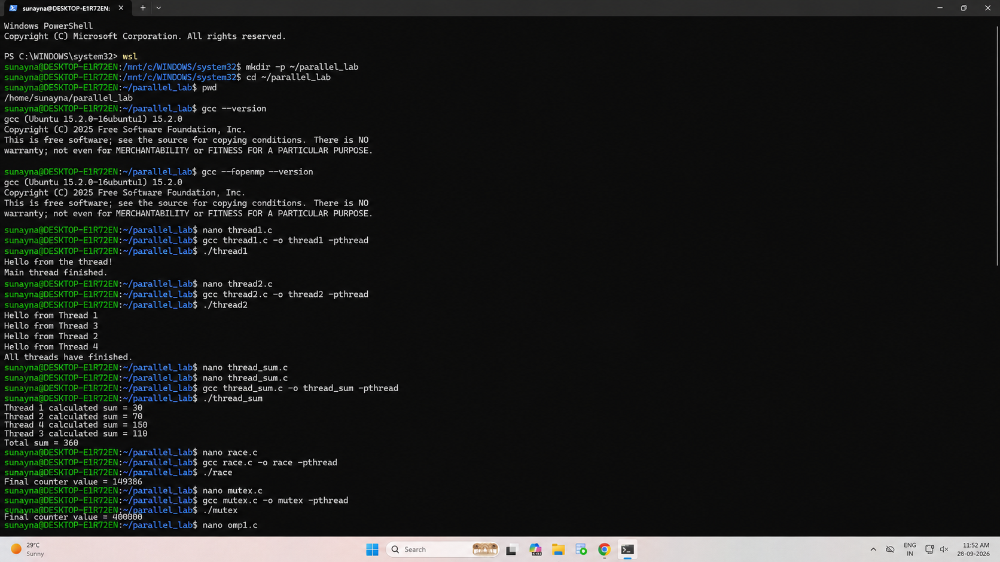<br>
  <em>Figure A.1 — Environment check (<code>wsl</code>, <code>pwd</code>, <code>gcc --version</code>, <code>gcc -fopenmp --version</code>) and Pthreads Steps 1–5: thread1, thread2, thread_sum, race (149386) and mutex (400000).</em>
</p>

---

## 8. Part B — OpenMP

OpenMP provides a simpler, higher-level way to parallelize code. Instead of creating every thread manually, we use `#pragma omp` directives and the OpenMP runtime takes care of the thread management.

### Step 6 — First OpenMP Parallel Region (`omp1.c`)

```c
#pragma omp parallel                                // run the block below on MANY threads
{
    int thread_id     = omp_get_thread_num();       // "Which thread am I?"
    int total_threads = omp_get_num_threads();      // "How many threads are in the team?"
    printf("Hello from thread %d of %d\n", thread_id, total_threads);
}
```

**Output (this run, 32 lines, order shuffled):**

```text
Hello from thread 1 of 32
Hello from thread 26 of 32
Hello from thread 5 of 32
...
Hello from thread 0 of 32
...
Hello from thread 6 of 32
```

No thread count was given, so OpenMP **automatically created one thread per logical CPU, which is 32 on this system**. We never called `pthread_create()`. OpenMP did it for us.

---

### Step 7 — Work Sharing and Reduction (`omp_sum.c`)

```c
int total_sum = 0;

#pragma omp parallel for reduction(+:total_sum)     // split the loop + combine sums safely
for (int i = 0; i < ARRAY_SIZE; i++) {
    printf("Thread %d processed array[%d] = %d\n", omp_get_thread_num(), i, array[i]);
    total_sum += array[i];
}
```

- `parallel for` → OpenMP **divides the loop iterations** among the threads automatically.
- `reduction(+:total_sum)` → each thread keeps its **own private partial sum**, and OpenMP **adds them together safely** at the end. This avoids the race condition.

**Output (this run):**

```text
Thread 7 processed array[7] = 80
Thread 3 processed array[3] = 40
Thread 4 processed array[4] = 50
Thread 6 processed array[6] = 70
Thread 1 processed array[1] = 20
...
Total sum = 360
```

Compare this with Step 3: the **same result (360)** needs far less code, with no manual start/end indexes and no partial-sum array.

### Part B Screenshot (Steps 6–7)

<p align="center">
  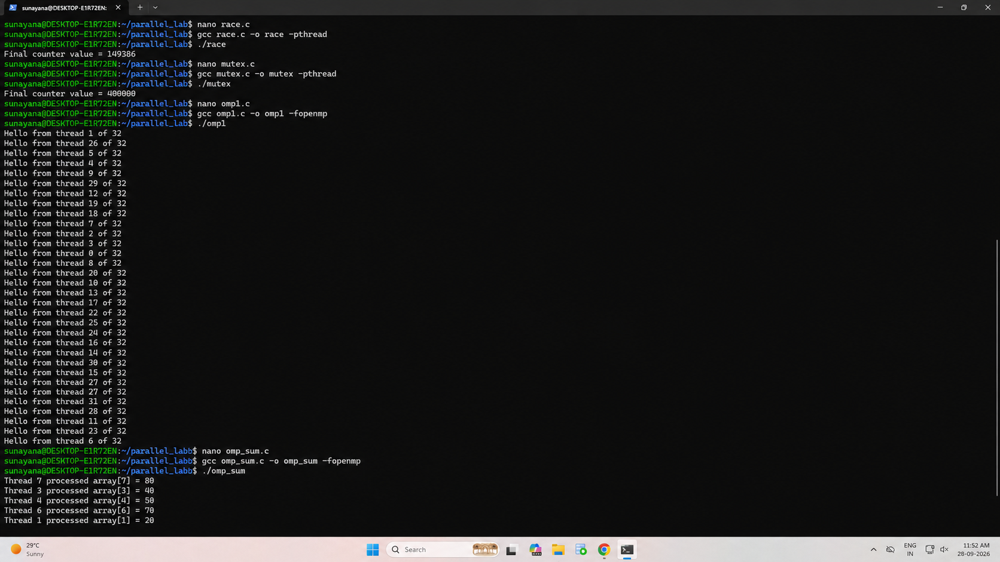<br>
  <em>Figure B.1 — OpenMP Step 6 (<code>omp1</code>: 32 threads reporting in random order) and Step 7 (<code>omp_sum</code>: loop iterations shared between threads).</em>
</p>

---

### Step 8 — Race Condition in OpenMP (`omp_race.c`)

```c
omp_set_num_threads(4);
#pragma omp parallel
{
    for (int i = 0; i < INCREMENTS; i++)
        counter++;                        // same unsafe update as race.c
}
```

**Output (this run):**

```text
Expected counter = 400000
Actual counter = 100000
```

**Lesson:** OpenMP creates and manages the threads, but it does **not** automatically make shared data safe. In this run the result was only 100,000, so the work of **three of the four threads was lost** because the threads kept overwriting each other's updates.

---

### Step 9 — Protecting the Counter with `critical` (`omp_critical.c`)

```c
#pragma omp parallel
{
    for (int i = 0; i < INCREMENTS; i++) {
        #pragma omp critical              // only ONE thread at a time may enter
        {
            counter++;
        }
    }
}
```

```text
Thread 1 -> enters      Thread 2, 3, 4 -> wait
Thread 1 -> exits       Thread 2 -> enters ...
```

**Output (this run):**

```text
Expected counter = 400000
Actual counter = 400000
```

✅ `critical` is the OpenMP equivalent of the Pthreads mutex.

---

### Step 10 — Coordinating Threads with a Barrier (`omp_barrier.c`)

```c
omp_set_num_threads(4);
#pragma omp parallel
{
    int thread_id = omp_get_thread_num();
    printf("Thread %d completed Stage 1\n", thread_id);

    #pragma omp barrier                   // EVERY thread must arrive here before ANY continues

    printf("Thread %d started Stage 2\n", thread_id);
}
```

**Output (this run):**

```text
Thread 1 completed Stage 1
Thread 3 completed Stage 1
Thread 2 completed Stage 1
Thread 0 completed Stage 1
Thread 3 started Stage 2
Thread 0 started Stage 2
Thread 2 started Stage 2
Thread 1 started Stage 2
```

The order **inside** each stage is random, but **all four "Stage 1" lines appear before any "Stage 2" line**. The barrier acts as a **meeting point**:

```text
Thread 0 -- Stage 1 --|
Thread 1 -- Stage 1 --|
Thread 2 -- Stage 1 --|-- BARRIER --> Stage 2 (all threads together)
Thread 3 -- Stage 1 --|
```

This is **thread coordination**. It is needed whenever stage 2 depends on results from stage 1.

### Part B Screenshot (Steps 8–10)

<p align="center">
  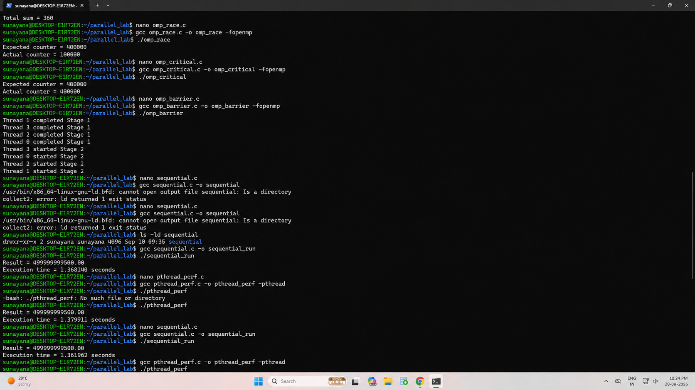<br>
  <em>Figure B.2 — <code>omp_race</code> (100000 ≠ 400000), <code>omp_critical</code> (400000 ✅), <code>omp_barrier</code> (all Stage 1 before Stage 2), followed by the start of the sequential and Pthreads timing runs.</em>
</p>

---

## 9. Part C — Performance Programs

**Question:** *How much faster does the program become when we add more threads?*

To make the comparison fair, the sequential, Pthreads and OpenMP versions perform the **same calculation**:

$$
\text{sum} = \sum_{i=0}^{N-1} i \times 0.000001, \qquad N = 10^9 \ (\text{one billion iterations})
$$

The expected result is $0.000001 \times \frac{N(N-1)}{2} =$ **499,999,999,500.00**. All three programs print this value, so the answers can be checked.

### Step 11 — Measuring the Sequential Version (`sequential.c`)

```c
double start = get_time();                 // clock_gettime(CLOCK_MONOTONIC)
for (long i = 0; i < N; i++)
    sum += (double)i * 0.000001;
double end = get_time();
```

| Run | Execution time |
|:-:|:--|
| 1 | 1.368140 s |
| 2 | 1.361962 s |
| **Average (baseline)** | **1.365051 s** |

We use this sequential time as the **baseline** and compare the parallel versions against it.

### Step 12 — Measuring the Pthreads Version (`pthread_perf.c`)

The loop range `0 … N` is split into **equal chunks**, one per thread. The last thread also takes any leftover iterations. Each thread writes its result to its own slot in `partial_sum[]`, and the main thread adds them up after `pthread_join()`.

```c
long chunk = N / num_threads;
for (int i = 0; i < num_threads; i++) {
    data[i].thread_id = i;
    data[i].start = i * chunk;
    data[i].end   = (i == num_threads - 1) ? N : (i + 1) * chunk;   // last thread takes the rest
    pthread_create(&threads[i], NULL, calculate, &data[i]);
}
for (int i = 0; i < num_threads; i++)
    pthread_join(threads[i], NULL);
for (int i = 0; i < num_threads; i++)
    total_sum += partial_sum[i];                                     // combine
```

### Step 14 — Measuring the OpenMP Version (`omp_perf.c`)

The same work needs **just one line** in OpenMP:

```c
omp_set_num_threads(num_threads);
#pragma omp parallel for reduction(+:sum)
for (long i = 0; i < N; i++)
    sum += (double)i * 0.000001;
```

Both programs take the thread count as input and were tested with **1, 2, 4, 6 and 16** threads. The measured time includes the work of starting and finishing the threads, so it represents the overall cost of the parallel run.

### Part C Screenshots

<p align="center">
  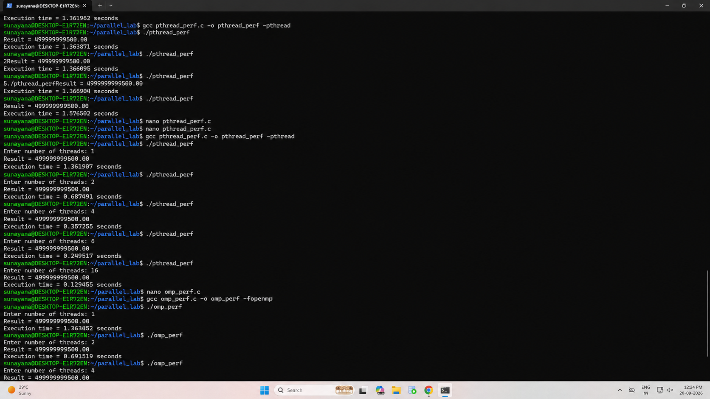<br>
  <em>Figure C.1 — Pthreads runs with 1, 2, 4, 6 and 16 threads, and the start of the OpenMP runs.</em>
</p>

<p align="center">
  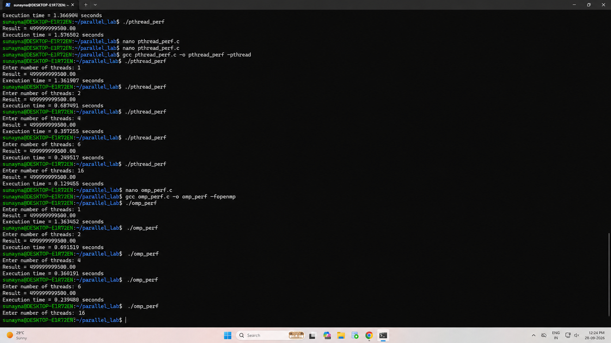<br>
  <em>Figure C.2 — Complete Pthreads and OpenMP timing runs (1, 2, 4, 6 and 16 threads). Every run prints the correct result 499999999500.00.</em>
</p>

---

## 10. Consolidated Results

### 10.1 Functional Programs (Parts A and B)

| # | Program | Concept Shown | Result Observed | Status |
|:-:|:--|:--|:--|:-:|
| 1 | `thread1.c` | Create one thread + join | "Hello from the thread!" then "Main thread finished." | ✅ |
| 2 | `thread2.c` | Create many threads | Threads printed in order 1, 3, 2, 4 | ✅ |
| 3 | `thread_sum.c` | Divide work | 30 + 70 + 110 + 150 = **360** | ✅ |
| 4 | `race.c` | Race condition | **149,386** instead of 400,000 | ⚠️ wrong (as intended) |
| 5 | `mutex.c` | Mutex fix | **400,000** | ✅ |
| 6 | `omp1.c` | Parallel region | 32 threads, random order | ✅ |
| 7 | `omp_sum.c` | Work sharing + reduction | Total sum = **360** | ✅ |
| 8 | `omp_race.c` | Race condition | **100,000** instead of 400,000 | ⚠️ wrong (as intended) |
| 9 | `omp_critical.c` | Critical-section fix | **400,000** | ✅ |
| 10 | `omp_barrier.c` | Barrier | All Stage 1 before any Stage 2 | ✅ |

### 10.2 Performance Programs (Part C)

**Sequential baseline = 1.365051 s** (average of 2 runs)

| Threads | Pthreads Time (s) | OpenMP Time (s) | Pthreads Speedup | OpenMP Speedup | Pthreads Efficiency | OpenMP Efficiency |
|:-:|--:|--:|--:|--:|--:|--:|
| 1 | 1.361907 | 1.363452 | 1.00× | 1.00× | 100.2 % | 100.1 % |
| 2 | 0.687491 | 0.691519 | 1.99× | 1.97× | 99.3 % | 98.7 % |
| 4 | 0.357255 | 0.360191 | 3.82× | 3.79× | 95.5 % | 94.7 % |
| 6 | 0.249517 | 0.239480 | 5.47× | 5.70× | 91.2 % | 95.0 % |
| 16 | **0.129455** | 0.135777 | **10.54×** | 10.05× | 65.9 % | 62.8 % |

All the tested runs produced the expected value, **499999999500.00**.

**Worked example (OpenMP, 16 threads):**

$$
S = \frac{1.365051}{0.135777} = 10.05\times, \qquad E = \frac{10.05}{16} \times 100 = 62.8\%
$$

Raw data: [`results/timing_results.csv`](results/timing_results.csv) · [`results/sequential_runs.csv`](results/sequential_runs.csv) · [`results/race_condition_results.csv`](results/race_condition_results.csv)

---

## 11. Performance Analysis

The graphs in this section are produced using **matplotlib**. The script [`scripts/generate_graphs.py`](scripts/generate_graphs.py) reads the CSV files from `results/` and creates the seven figures.

### 11.1 Execution Time vs Number of Threads

<p align="center">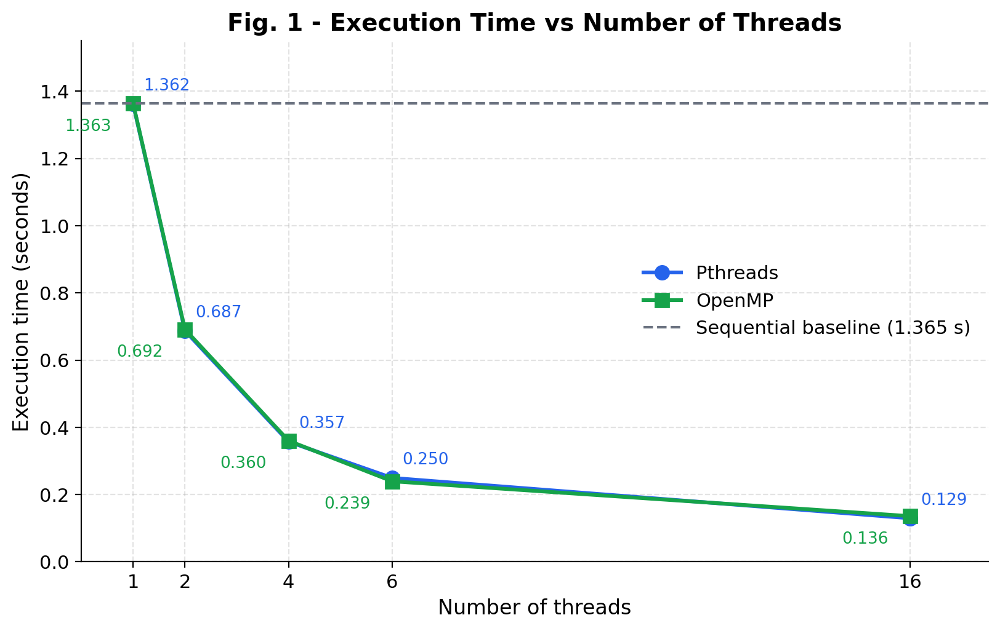</p>

**What the graph shows:**

- The run time **falls quickly** as threads are added: 1.36 s → 0.69 s → 0.36 s → 0.24 s → 0.13 s.
- **Doubling the threads roughly halves the time** from 1 → 2 → 4 threads.
- After 6 threads the curve **flattens**. Going from 6 to 16 threads (2.7× more threads) only reduces the time by about 1.9×.
- The Pthreads and OpenMP lines lie **almost on top of each other**.

### 11.2 Speedup vs Number of Threads

<p align="center">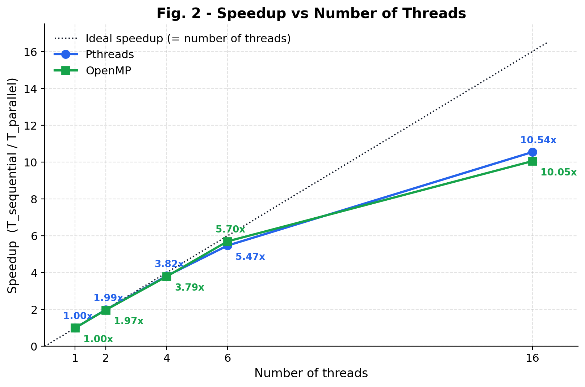</p>

**What the graph shows:**

- From **1 to 6 threads**, both lines stay **very close to the ideal line** (speedup = number of threads).
- At **16 threads**, the lines fall clearly **below** the ideal: about **10.5×** instead of 16×.
- The best measured speedup is **10.54× (Pthreads, 16 threads)**.

### 11.3 Efficiency vs Number of Threads

<p align="center">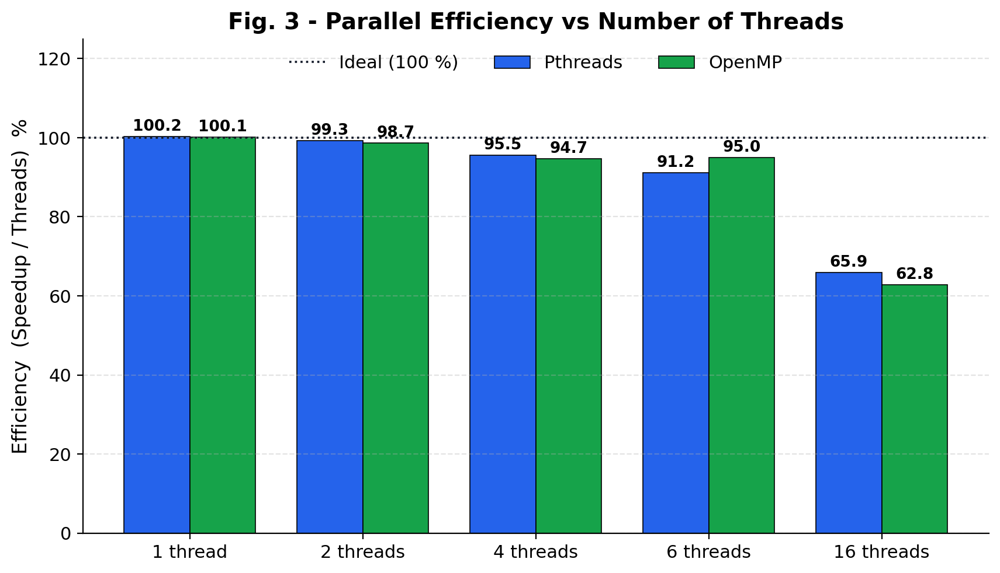</p>

**What the graph shows:**

- Up to 6 threads, efficiency stays **above 91 %**, so almost every thread is doing useful work.
- At 16 threads, efficiency drops to **63–66 %**. On average, each thread delivers only about two-thirds of its ideal contribution.
- The 1-thread efficiency is slightly **above 100 %** (100.2 %). This is not a real gain. It is **normal run-to-run variation** of a few milliseconds compared with the sequential baseline.

### 11.4 Pthreads vs OpenMP

<p align="center">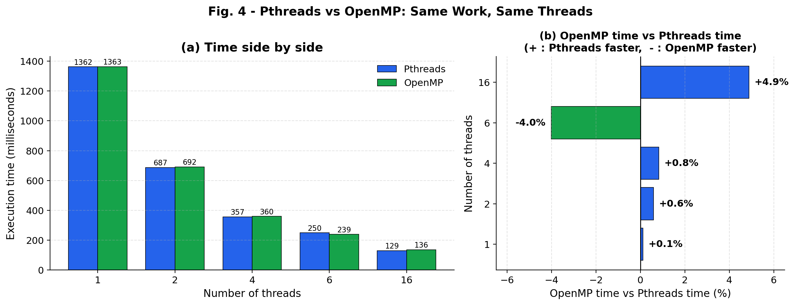</p>

**What the graph shows:**

- The two libraries differ by **less than 5 % at every thread count**.
- Pthreads was slightly faster at 2, 4 and 16 threads. OpenMP was faster at 6 threads (by 4.0 %).
- There is no consistent winner, because these small differences are the same size as normal run-to-run variation.
- **Why are they so close?** On Linux, GCC's OpenMP runtime (`libgomp`) is itself **built on top of Pthreads**. Both programs end up using the same kind of operating-system threads and split the loop into the same kind of equal chunks.

### 11.5 Race Condition vs Synchronisation

<p align="center">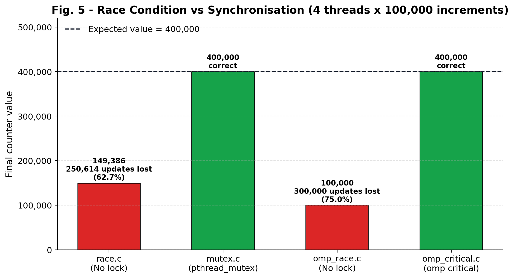</p>

**What the graph shows:**

- **Without any lock**, both libraries gave **wrong answers**: Pthreads lost **62.7 %** of the updates and OpenMP lost **75.0 %**.
- **With a lock** (a mutex for Pthreads, `critical` for OpenMP), both gave the **exact correct answer, 400,000**.
- **Lesson:** creating threads is easy, but **any shared variable that threads change must be protected**. Otherwise the result is unpredictable.

### 11.6 Ideal vs Measured Time (Parallel Overhead)

<p align="center">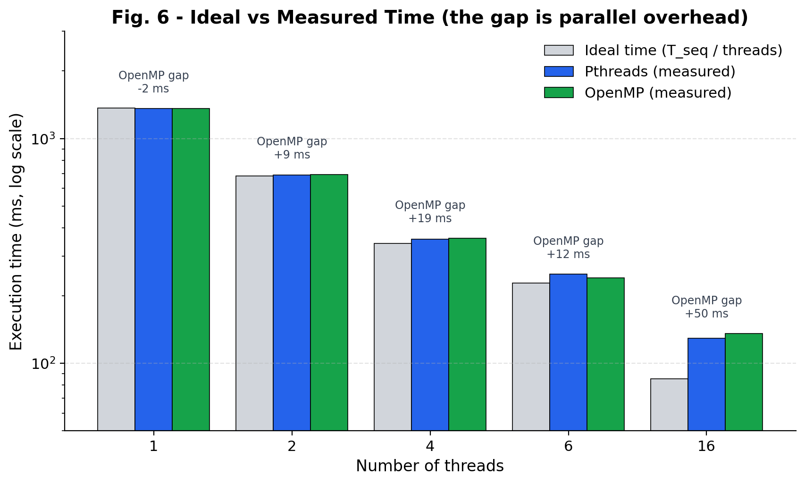</p>

**What the graph shows:**

- The grey bar shows the **ideal time** ( $T_{seq}$ / threads ). The blue and green bars show the **measured times**.
- At 2–6 threads the gap is small (about 9–19 ms).
- At 16 threads, the ideal time is **85 ms** but the measured time is **129–136 ms**. The extra **~45–50 ms is parallel overhead**.

### 11.7 Why Don't 16 Threads Give a 16× Speedup?

Ideally, $1.365 / 16 \approx 0.085$ s, but the measured OpenMP time was $0.136$ s. The main reasons are:

| Reason | Simple explanation |
|:--|:--|
| **Thread management cost** | Creating, starting and joining 16 threads takes time. That cost stays the same while each thread's share of the work becomes smaller. |
| **Shared CPU cores (hyper-threading)** | The 32 logical CPUs are most likely 16 physical cores with 2 hardware threads each. Two threads on one core share its arithmetic units, so they do not run at double speed. |
| **Lower clock speed under heavy load** | When many cores are busy, a CPU usually lowers its clock speed to stay within power and heat limits, so each core runs a little slower. |
| **Operating system and WSL** | Other Windows and Linux processes, plus the WSL virtualisation layer, also need CPU time and can interrupt the threads. |
| **Non-parallel work** | Some work is always sequential: reading the thread count, setting up the chunks and adding the partial sums. |

**Conclusion:** more threads **do** reduce the run time, but the speedup is **not perfectly linear**, because every parallel program carries some overhead.

### 11.8 Performance Summary

<p align="center">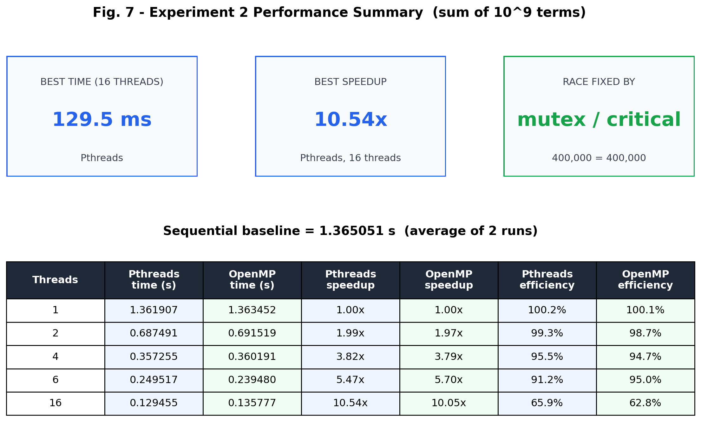</p>

### 11.9 Comparison with the Lab-Manual Reference

| Measure | Lab manual (reference) | This experiment |
|:--|--:|--:|
| Sequential baseline | 1.353219 s | 1.365051 s |
| Pthreads, 16 threads | 0.144812 s (9.35×) | 0.129455 s (**10.54×**) |
| OpenMP, 16 threads | 0.140692 s (9.62×) | 0.135777 s (**10.05×**) |
| Efficiency at 16 threads | 58.4 % / 60.1 % | 65.9 % / 62.8 % |

The results follow the same general pattern as the lab reference: execution time decreases as threads are added, efficiency remains strong up to 6 threads, and Pthreads and OpenMP stay close to each other. The 16-thread result in this experiment gives a **slightly higher speedup** than the reference value.

---

## 12. Pthreads vs OpenMP — Comparison

| Concept | Pthreads | OpenMP |
|:--|:--|:--|
| Create threads | `pthread_create()` | `#pragma omp parallel` |
| Wait for threads | `pthread_join()` | Handled automatically at the end of the region |
| Work distribution | Programmer divides the work by hand | `parallel for` divides loop iterations |
| Protect shared data | Mutex (`pthread_mutex_lock/unlock`) | `#pragma omp critical` |
| Coordination | Join / other synchronisation tools | `#pragma omp barrier` |
| Combine partial results | Programmer-managed (`partial_sum[]` array) | `reduction(+:var)` |
| Lines of code for the performance loop | ≈ 30 (struct, chunking, create, join, combine) | ≈ 3 (one pragma + loop) |
| Measured speed (16 threads) | 0.129 s | 0.136 s |
| Control | Full, fine-grained control | Less control, much simpler |
| Best used for | Custom thread behaviour, servers, background tasks | Parallelising loops in numeric/scientific code |

**In simple terms:** the performance of the two approaches is very similar. OpenMP needs much less code, while Pthreads gives the programmer more direct control over thread behaviour.

---

## 13. Observations and Limitations

**Observations:**

1. Thread **output order changes between runs**, because the operating system decides when each thread runs.
2. **Unprotected shared data gives wrong and changing results.** Mutexes and critical sections fix this.
3. A **barrier** guarantees that every thread finishes one stage before any thread starts the next.
4. For this calculation, **more threads always meant less time**, with near-perfect scaling up to 6 threads.
5. **Pthreads and OpenMP perform almost the same**. The main difference is how easy they are to program.

**Limitations of the measurements:**

| Limitation | Effect |
|:--|:--|
| Each thread count was run **once** | Small differences (a few %) may just be noise. More runs and an average would be more reliable. |
| Programs compiled **without `-O2`** | Absolute times are higher than optimised code, but all versions are treated the same, so the comparison stays fair. |
| Run inside **WSL2** | Windows background activity can affect timings slightly. |
| Only 1, 2, 4, 6 and 16 threads tested | The behaviour at 8, 12 or 32 threads was not measured. |

---

## 14. Troubleshooting and Issues Encountered

### 14.1 Issues Actually Encountered During This Experiment

| Issue | Seen in | Cause | Fix |
|:--|:--|:--|:--|
| `ld: cannot open output file sequential: Is a directory` | Fig. B.2 | A **folder** named `sequential` already existed in `~/parallel_lab` (created in Experiment 1), so GCC could not create a file with the same name | Checked with `ls -ld sequential`, then compiled to a different name: `gcc sequential.c -o sequential_run` |
| `-bash: /pthread_perf: No such file or directory` | Fig. B.2 | Typing mistake: `/pthread_perf` instead of `./pthread_perf` (the leading dot was missing) | Re-ran as `./pthread_perf` |
| `pthread_perf` did not ask for the thread count, and every run took ≈ 1.36 s | Fig. C.1 | The first saved version of `pthread_perf.c` did not contain the `Enter number of threads` prompt, so the typed values were ignored and it ran single-threaded | Re-opened the file in nano, pasted the full program, recompiled, and the prompt appeared |

### 14.2 General Troubleshooting Guide

| Problem | Solution |
|:--|:--|
| `undefined reference to pthread_create` | Add `-pthread` to the compile command |
| `#pragma omp` is ignored (only 1 thread runs) | Add `-fopenmp` to the compile command |
| `omp.h: No such file or directory` | Install GCC with `sudo apt install build-essential` |
| Output order looks "wrong" | This is normal. Thread order is not guaranteed |
| Counter result is less than expected | Race condition. Protect the update with a mutex, `critical` or `atomic` |
| Program hangs at a barrier or join | Make sure every thread actually reaches the barrier, and join only threads that were created |
| `cannot open output file ...: Is a directory` | Use a different output name with `-o` |

---

## 15. Important Terms

| Term | Meaning |
|:--|:--|
| **Thread** | A path of execution inside a program |
| **Main thread** | The thread that starts running `main()` when the program begins |
| **Additional thread** | A new thread created by the program, e.g. with `pthread_create()` |
| **Multithreading** | Using more than one thread inside one program |
| **Parallel programming** | Dividing work so that several execution units can do parts of it at the same time |
| **Work distribution** | Splitting one large task into smaller tasks and giving them to different threads |
| **Race condition** | Threads change shared data without coordination, so the result can be wrong |
| **Mutex** | A Pthreads lock that lets only one thread at a time into a protected section |
| **Critical section** | A part of the code that only one thread may run at a time |
| **Barrier** | A meeting point where threads wait until all of them have arrived |
| **Reduction** | Each thread computes a partial result, and these are safely combined into one value |
| **Speedup** | How many times faster the parallel program is than the sequential one |
| **Efficiency** | How well the threads are used (speedup ÷ number of threads) |
| **Overhead** | Extra time spent managing parallel work instead of doing the actual calculation |

---

## 16. Conclusion

Through this experiment, we learned how to build and test multithreaded programs using **Pthreads** and **OpenMP**.

- **Pthreads** gives **explicit control**: threads are created with `pthread_create()`, waited for with `pthread_join()`, and shared data is protected with a **mutex**.
- **OpenMP** is a **higher-level** model: **parallel regions**, **work-sharing loops**, **critical sections**, **barriers** and **reductions** are all expressed with simple `#pragma` lines.
- Both libraries showed that **unprotected shared data causes race conditions**. Pthreads lost 62.7 % of the updates and OpenMP lost 75.0 %. **Synchronisation** (a mutex or `critical`) restored the correct result of 400,000.
- In the performance test, both libraries **reduced execution time substantially**, from **1.365 s** to about **0.13 s** with 16 threads. The best speedup was **10.54×** (Pthreads).
- **Efficiency stayed above 91 % up to 6 threads** but dropped to **about 63–66 % at 16 threads**. Speedup is **not perfectly proportional** to the number of threads because of thread management, shared CPU cores, clock-speed changes, operating-system activity and non-parallel work.
- **Pthreads and OpenMP performed almost identically** (within 5 %). For loop-based numerical work, OpenMP gives the same speed with far less code.

The three graphs, execution time, speedup and efficiency, give three views of one result: **more threads make the program faster, but each extra thread adds a little less than the one before.**

---

## 17. Project Structure and How to Run It

The folder names below match the repository exactly, including capitalization (`OpenMP`, `Graph`, `PerformanceAnalysis`). The README image links and reproduction commands use these exact paths.

```text
Experiment_2/
├── README.md                        ← this report
├── Pthreads/                        ← screenshot, Part A (Steps 1–5)
│   └── pthread_step_1_5.png
├── OpenMP/                          ← screenshot, Part B (Steps 6–7)
│   └── Openmp_step_6_7.png
├── PerformanceAnalysis/             ← screenshots, Steps 8–14
│   ├── Performance_analysis_1.png
│   ├── Performance_analysis_2.png
│   └── Performance_analysis_3.png
├── src/
│   ├── pthreads/                    ← thread1.c, thread2.c, thread_sum.c, race.c, mutex.c
│   ├── openmp/                      ← omp1.c, omp_sum.c, omp_race.c, omp_critical.c, omp_barrier.c
│   └── performance/                 ← sequential.c, pthread_perf.c, omp_perf.c
├── results/
│   ├── timing_results.csv           ← Pthreads / OpenMP times
│   ├── sequential_runs.csv          ← sequential baseline runs
│   └── race_condition_results.csv   ← race vs fixed counter values
├── scripts/
│   └── generate_graphs.py           ← matplotlib graph generator
└── Graph/                           ← 7 generated figures
```

**Quick reproduction (Linux / WSL2):**

```bash
# From the Experiment_2 folder
cd Experiment_2

# Part A - Pthreads
gcc src/pthreads/thread1.c    -o thread1_run    -pthread && ./thread1_run
gcc src/pthreads/thread2.c    -o thread2_run    -pthread && ./thread2_run
gcc src/pthreads/thread_sum.c -o thread_sum_run -pthread && ./thread_sum_run
gcc src/pthreads/race.c      -o race_run      -pthread && ./race_run
gcc src/pthreads/mutex.c     -o mutex_run     -pthread && ./mutex_run

# Part B - OpenMP
gcc src/OpenMP/omp1.c        -o omp1_run        -fopenmp && ./omp1_run
gcc src/OpenMP/omp_sum.c     -o omp_sum_run     -fopenmp && ./omp_sum_run
gcc src/OpenMP/omp_race.c    -o omp_race_run    -fopenmp && ./omp_race_run
gcc src/OpenMP/omp_critical.c -o omp_critical_run -fopenmp && ./omp_critical_run
gcc src/OpenMP/omp_barrier.c -o omp_barrier_run -fopenmp && ./omp_barrier_run

# Part C - Performance
gcc src/performance/sequential.c   -o sequential_run
gcc src/performance/pthread_perf.c -o pthread_perf -pthread
gcc src/performance/omp_perf.c     -o omp_perf -fopenmp

# Run the performance programs and enter: 1, 2, 4, 6 and 16
./sequential_run
./pthread_perf
./omp_perf

# Regenerate the 7 graphs
pip install matplotlib pandas numpy
python scripts/generate_graphs.py
```

---

## 18. References and Sources

1. IEEE Std 1003.1 (POSIX.1), *POSIX Threads (pthreads)*, The Open Group.
2. OpenMP Architecture Review Board, *OpenMP Application Programming Interface Specification*, Version 5.2, 2021.
3. GNU Project, *GNU libgomp — GNU Offloading and Multi-Processing Runtime Library Manual*.
4. B. Barney, *POSIX Threads Programming* and *OpenMP* tutorials, Lawrence Livermore National Laboratory.
5. A. Grama, A. Gupta, G. Karypis and V. Kumar, *Introduction to Parallel Computing*, 2nd ed., Addison-Wesley, 2003.
6. *Experiment — Develop Multithreaded Programs Using Parallel Programming Libraries to Understand Thread Creation, Management, and Coordination*, Lab Manual, PGC Laboratory.

---

<div align="center"><sub>Experiment 2 · Parallel Computing and GPU Programming Laboratory</sub></div>
